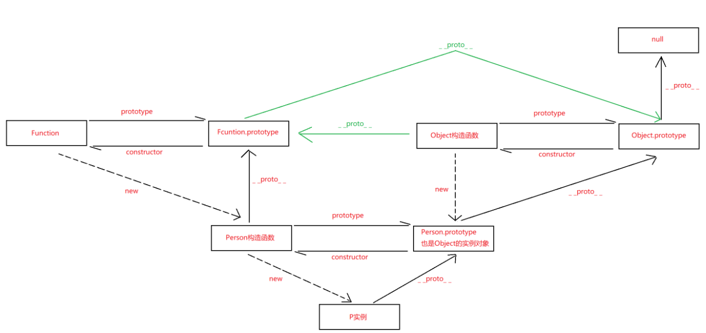

# Object

https://developer.mozilla.org/zh-CN/docs/Web/JavaScript/Reference/Global_Objects/Object

## 原型

`_proto_`：实例对象中的一个属性，它指向构造函数的原型

`prototype`：构造函数中的一个属性，它被称为原型，本身也是一个对象；它也存在 `_proto_`属性，自动寻找上一级原型直到 `Object.prototype`

当访问一个对象的属性或方法时，如果该对象本身没有这个属性或方法，JavaScript 会沿着原型链向上查找，直到找到这个属性或方法或者到达原型链的末端。

 


## 代理

它允许你定义一个对象的基本操作的自定义行为（如属性查找、赋值、枚举、函数调用等）

基本语法

```ts
// target 代理目标
// handler 代理行为。可定义各种拦截器方法，如 get、set、apply 等
const proxy = new Proxy(target,handler)
```

拦截器方法（Reflect对象上的方法与此相同）

```ts
// recevier: 指的是代理实例
get(target, property, receiver) 
// 对象属性的读取操作
set(target, property, value, receiver) 
// 对象属性的赋值操作
has(target, property) 
// in 操作符和 with 语句
deleteProperty(target, property) 
// delete 操作符
ownKeys(target) 
// Object.getOwnPropertyNames()、Object.getOwnPropertySymbols()、Object.keys()
getOwnPropertyDescriptor(target, property) 
// Object.getOwnPropertyDescriptor()
defineProperty(target, property, descriptor) 
// Object.defineProperty() 和 Reflect.defineProperty()
apply(target, thisArg, argumentsList) 
// 函数调用、call 和 apply 操作
construct(target, argumentsList, newTarget) 
// new 操作符
```

可取消代理

```ts
var obj = {a:1}

var handlers = {
  get(target,key,context){
    console.log('get',key+':'+target[key]);
    return target[key]
  }
}

var p = {
  proxy:'',
  revoke:'',
}

p=Proxy.revocable(obj,handlers)
p.proxy.a;
p.revoke(); // 取消代理
p.proxy.a; // TypeError: Cannot perform 'get' on a proxy that has been revoked
```


## 对象解构

```js
const person = { name: 'zs', age: 18 }

// 默认
const   { name, age } = person // name: 'zs', age: 18
// 重命名
const { name: newName } = person // newName: 'zs'
// 不存在
const { addr } = person // addr: undefined
// 默认值
const { addr='zh' } = person // addr: 'zh'
```


## 静态方法

### Object.is

判断两个值是否相同

```js
Object.is(NaN, NaN) // true
```


### Object.assign

将多个对象中的可枚举的自有属性复制到目标对象中，返回修改后的目标对象

```js
const target = { a: 1, b: 2 }
const source = { b: 3, c: 4 }

const rt = Object.assign(target, source, {d: 5}) 
// { a:1, b:3, c:4, d:5 }
```


### Object.create

以现有对象为原型，创建新的对象

```js
const obj = { name: 'zs' }
const rt = Object.create(obj)
rt.name = 'rt'
console.log(obj === rt) // false

// obj: {name:'zs'}, rt: {name: 'rt'}
```


### Object.defineProperty

为对象定义新属性或修改现有属性，返回此对象

```js
const obj = {}
const rt = Object.defineProperty(obj, 'name', {
  value: 'zs',
  witable: false,
  enumable: false,
})

console.log(rt === obj) // true 
```


### Object.getOwnPropertyNames

返回给定对象中所有自有属性，包括不可枚举但不包括`symbol`属性组成的数组

```js
const obj = { a: 1, [Symbol('b')]: 2}
Object.defineProperty(obj, 'c', { enumable: false })
Object.getOwnPropertyNames(obj) // ['a', 'c']
```

返回给定对象中的可枚举的自身属性，但不包括`symbol`属性所组成的数组

```js
Object.keys() // ['a']
```

