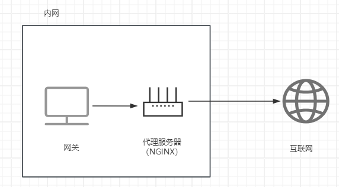

## 前期准备

软件：Vmware

镜像：CentOS-7-x86_64-Minimal-2009.iso

CentOS：https://vault.centos.org/

XShell：https://www.xshell.com/zh/free-for-home-school/

Termius: https://termius.com/download/windows

Nginx: https://nginx.org/en/download.html 

> win+R -> msinfo32 ->系统信息


### 虚拟机配置

网卡配置

```bash
# 点击两次tab 将显示该目录下的文件
vi /etc/sysconfig/network-scripts/ 
vi /etc/sysconfig/network-scripts/ifcfg-ens33 

# i进入编辑模式，修改配置文件 
ONBOOT=yes 			    # 默认no，启用网卡
BOOTPROTO=static 		# 默认dhcp，使用静态IP分配
IPADDR=192.168.9.200 	# IP地址
NETMASK=255.255.255.0 	# 子网掩码
GATEWAY=192.168.9.2 	# 网关
DNS=8.8.8.8 		    # DNS

# 添加配置DNS
vi /etc/resolve.conf
nameserver 8.8.8.8

# 重启服务
systemctl restart network
```

vmare编辑 -> 虚拟网络编辑器 -> VMnet8 -> NAT设置 

```bash
192.168.9.0    # 子网IP
255.255.255.0  # 子网掩码
192.168.9.2    # 网关
```

主机电脑网络中配置网卡VMnet8

```bash
# IPV4协议中使用以下面IP地址 
192.168.9.1
255.255.255.0
# 禁用网卡再启动
```


### 关于防火墙

```bash
systemctl start firewalld.service # 开启防火墙
systemctl restart firewalld.service # 重启防火墙
systemctl stop firewalld.service # 关闭防火墙
systemctl disable firewalld.service # 禁止开机自启
firewall-cmd --zone=public --add-port=80/tcp --permanent # 放行端口
firewall-cmd --query-port=80/tcp # 查看端口是否开放
firewall-cmd --permanent --add-port=9001-9002/tcp # 批量放行
firewall-cmd --permanent --remove-port=9002/tcp # 移除端口
firewall-cmd --reload # 重新加载
firewall-cmd --list-all # 查看已配置规则
# 指定端口和IP访问
firewall-cmd --permanent --add-rich-rule="rule family="ipv4" source address="192.168.174.135" port protocol="tcp" port="8080" accept"
# 移除端口和IP访问
firewall-cmd --permanent --remove-rich-rule="rule family="ipv4" source address="192.168.174.135" port port="8080" protocol="tcp" accept" 
```


### NGINX安装(源码)

环境配置

```shell
gcc # 编译器
pcre pcre-devel # 正则表达式解析
zlib zlib-devel # 压缩库
openssl openssl-devel # SSL

yum install -y gcc pcre pcre-devel zlib zlib-devel openssl openssl-devel
rpm -qa gcc pcre pcre-devel ... # 查看依赖是否安装成功
```

源码下载

```shell
# XFTP上传下载的NGINX压缩包至虚拟机
wget https://nginx.org/download/nginx-1.16.1.tar.gz
```

管理安装包

```shell
mkdir -p nginx/core
mv nginx-1.16.1.tar.gz nginx/core
```

解压安装包

```shell
cd nginx/core
tar zxvf nginx-1.16.1.tar.gz
cd nginx-1.16.1
./configure # 直接回车或添加参数 --help可查看可添加的参数
```

编译并安装NGINX

```bash
make && make install
```

### NGINX安装(yum)

https://nginx.org/en/linux_packages.html


### NGINX启动

```shell
cd /usr/local/nginx/sbin # 根目录下
./nginx -t # 修改配置文件后需要测试配置文件是否无误
./nginx # 启动
./nginx -s stop # 快速停止
./nginx -s quit # 退出前完成已接受的请求
./nginx -s reload # 重新加载配置


ip addr # 测试启动成功与否，获取IP(192.168.9.200)，浏览器访问
```


### NGINX卸载

```shell
./nginx -s stop # 停止nginx

rm -rf /usr/local/nginx # 卸载nginx

make clean # 清除编译环境
```


### NGINX版本升级

问题： 如何不停止服务的前提下升级NGINX版本

1、备份旧版本sbin目录下的nginx

```shell
cd /usr/local/nginx/sbin
mv nginx nginxold
```

2、拷贝新版本编译后`/objs/nginx` 的可执行文件到原来目录下

```shell
cd /nginx/core/nginx-version/objs
cp nginx /usr/local/nginx/sbin
```

3、升级版本

```shell
cd /root/nginx/core/nginx-version
make upgrade 
```


### 常用工具

curl：模拟网络请求

```bash
yum install -y curl
curl -I http://www.example.com # 返回响应头信息
curl -e "https://bilibili.com" -I http://www.example.com 
```

keepalived：提供服务故障切换和健康检查功能

```bash
yum install -y keepalived
/etc/keepalived/keepalived.conf # 配置文件位置
```

tree：树形显示目录解构

```shell
yum install -y tree # 树形结构目录
tree path # 命令格式
```


## 启动流程

### 进程

```shell
ps -ef | grep nginx
more /usr/local/nginx/logs/nginx.pid
```

| 信号     | 作用                                             |
| -------- | ------------------------------------------------ |
| TERM/INT | 立即关闭整个服务                                 |
| QUIT     | 优雅关闭整个服务，等待worker进程处理已接收的请求 |
| HUP      | 重新读取配置文件并使用服务对新配置项生效         |
| USR1     | 重新开启日志文件                                 |
| USR2     | 平滑升级到最新版nginx                            |
| WINCH    | 所有子进程不再接收处理新连接，关闭所有子进程     |

```shell
kill -sign pid # sign-信号 pid-marster线程ID
```


### 配置系统服务

1、创建脚本

```bash
vi /usr/lib/systemd/system/nginx.service 
```

脚本内容

```bash
[Unit] 
Description=nginx web service
After=network.target remote-fs.target nss-lookup.target

[Service]
Type=forking
PIDFile=/usr/local/nginx/logs/nginx.pid
ExecStartPre=/usr/local/nginx/sbin/nginx -t -c /usr/local/nginx/conf/nginx.conf
ExecStart=/usr/local/nginx/sbin/nginx
ExecReload=/usr/local/nginx/sbin/nginx -s reload
ExecStop=/usr/local/nginx/sbin/nginx -s stop
ExecQuit=/usr/local/nginx/sbin/nginx -s quit 
PrivateTmp=true
   
[Install]   
WantedBy=multi-user.target 
```

如果存在权限问题需要进行权限设置

```shell
chmod 755 /usr/lib/systemd/system/nginx.service 
```

2、重新加载

```bash
systemctl daemon-reload # 重新加载配置文件 （脚本）
systemctl reload nginx # 重新加载配置文件（nginx.conf）
```

3、重启nginx

```bash
systemctl status nginx # 查看是否正在启动nginx,启动则停止
systemctl start nginx # 启动nginx服务
systemctl restart nginx # 重启nginx服务
systemctl stop nginx # 停止nginx服务
systemctl reload nginx # 重新加载配置文件
```

4、开机自启

```bash
systemctl enable nginx # 开机自启
```


### 配置环境变量

无需每次执行命令都需要到安装目录下的`sbin`目录才能使用

```shell
# 1、修改环境文件
vi /etc/profile
# 最后一行添加
export PATH=$PATH:/usr/local/nginx/sbin

# 2、加载文件生效
source /etc/profile

# 3、测试
nginx -v
```


## 配置文件

### main

```bash
pid /usr/local/nginx/logs/nginx; # master进程ID存储的文件路径
dameon on; # 默认启动守护进程，关闭终端依旧能够提供服务
worker_processes  1; # woker进程个数，一个CPU内核对于一个进程数
```


### events

```bash
events {
	# 默认on,处理惊群问题，设置网络连接序列化
	accept_mutex off;
  # 默认off，同时处理接受请求
	multi_accept on;
	# worker最大连接数，最大值取决于系统支持打开的最大文件句柄数量
	worker_connection 1024; 
	# 默认无，指定事件驱动
	use epoll; 
}
```


### http

```bash
http {
    # 根据后缀匹配请求的资源，将对应的type返回给浏览器，浏览器根据type的类型进行解析
    include       mime.types; 
    # 若未找到对应的type，则使用默认typ
    default_type  application/octet-stream;

    sendfile        on; # 启用零复制
    keepalive_timeout  65; # 保持长连接的时间
}
```


### http server

匹配时优先级：准确、首段通配符、尾段通配符、正则  `（与配置server顺序无关）`

不匹配时优先级：匹配`listen`且包含 `default_server` 、匹配`listen`的第一个`server`

```bash
# 虚拟主机 vhost (可多个)
server {
  listen	80;
  server_name  localhost1 localhost2; # 多个主机和域名用空格隔开
}

# 通配符只能出现在首段和尾段
server {
	listen 80;
	server_name *.example.com;
}

server {
	listen 80;
	server_name www.example.*;
}

server {
	listen 80;
	server_name ~^[a-z]\.example\.com; 
}

server {
	listen 80 default_server;
	default_type text/plain;
	return 200 'default_server'
}
```


### http server location

`uri`变量是待匹配请求字符串，首先匹配非正则表达式，找到匹配度最高的一个，再匹配正则表达式，如果能够匹配到则直接访问，否则访问匹配度最高的那一个

```shell
location [= | ~ | ~* | ^~ | @] uri

= 严格匹配，匹配则停止
^~匹配路径前缀，匹配则停止
~区分大小写匹配
~*不区分大小写匹配
```

```bash
# 匹配 /abc /abcd /abedef.. ...
location /abc {}

# 匹配 /abc
location =/abc {}

# ~开头表示正则，匹配以abc开头\w结尾的路径 \w表示[0-9a-zA-Z_]
location ~/abc\w$ {}
```


## 重要指令

### root

```shell
root path 
# path: 表示请求资源时查找资源的根目录
# 作用域：http、server、location  
```

```shell
# 访问 /images/example.png 
location /images {
	root /usr/local/nginx/images;
}

# root 处理结果 = root + location
```


### alias

```shell
alias path 
# path: 表示请求资源时查找资源的根目录
# 作用域：location
```

```shell
# 访问 /images/example.png 
location /images {
	alias /usr/local/nginx/images;
}

# alias 处理结果 = 直接替换location
# 如果location以/结尾则alias必须以/结尾，root无此要求
```


### index

```shell
index file ... 
# 配置网站首页
# 可以添加多个文件，会逐个匹配直到匹配上
# 作用域：http、server、location
```

```shell
location / {
	root html;
	index index.html; 
}
```


### error_page

```shell
error_page code [...code] uri
# 配置错误页面
# 作用域：http, server, location, if in location
```

```shell
# 指定跳转地址
server {
	error_page 404 http://www.error.com;
}

# 指定重定向地址
server {
    error_page   500 502 503 504  /50x.html;
    location =/50x.html {
    	root html;
    }
}

# 配合location@符号
server {
	error_page 404 @error;
	location @error {
		default_type text/plain;
		return 404 'NOT FOUND PAGE';
	}
}

# 修改状态码
server {
	error_page 404 =200 /50x.html;
	location =/50x.html {
		root html;
	}
}
```


### use

https://nginx.org/en/docs/ngx_core_module.html#use

```bash
use method # 设置事件驱动模型,作用域：events
```


### user

配置worker进程的用户和用户组

```shell
user user_name [group_name]

# 默认,省略组名则等于用户名
user nobody nobody

# 例子
user www

# 添加用户，默认创建目录 /home/www
useradd www
```


### sendfile

计算机执行IO操作时，CPU不需要将数据从一个存储区域复制到另一个存储区域，从而可以减少上下文切换以及CPU的拷贝时间。它是一种I/O操作优化技术

```bash
sendfile on|off # 作用域：http、server、location
```

```shell
# 两者可以兼容，如大文件传输时，最后一份数据无法填满缓冲区则忽视tcp_nopush

tcp_nopush on|off 
# 开启sendfile才会生效，使用缓冲区，填满后再发送数据，提升网络包传输效率
tcp_nodelay on|off 
# 开启keepalive才会生效，有数据就发送，提升网络传输实时性
```

```shell
http {
	sendfile on; # 默认off
	tcp_nopush on; # 默认off
	tcp_nodelay on; # 默认on
	keepalive_time 65;
}
```

 

 


### add_header

```shell
add_header name value [always] 
# always: 无论浏览器是否支持都添加该响应头
# 作用域：http、server、location
```


### set

设置变量，不要与[内置变量](https://nginx.org/en/docs/varindex.html)重名

```shell
set $variable value 
# 作用域：http、server、if
# value：可以是字符串、变量、变量组合
```


### if

```shell
if (condition) {} # 作用域：server、location
```

```shell
# 零和空字符串为false
if ($parmas)

# =、!= 比较
if ($request_method = POST)

# 正则比较，~区分大小写，~*不区分大小写，!~ | !~* 取反
if($http_user_agen ~ MSIE)

# -f | !-f 文件是否存在
if (!-f $request_filename)

# -d | !-d 目录是否存在
# -e | !-e 目录和文件是否存在
# -x | !-x 文件是否是可执行的
```


### break

同作用域之前的配置生效，后面的无效；终止当前的匹配并把当前URI在本Location中进行重定向访问

```shell
break; # 作用域: server、location、if
```

```shell
location /example {
	if ($args) {
		break;
	}
	
	return 200
}

# 访问：/example?1, 结果是404而不是200
# nginx默认行为：root未配置，会从当前安装目录下的html开始找;index未配置,会从html目录下寻找对应index.html
# 在html目录下创建example目录，并在该目录下创建index.html
# 再次访问，显示index.html页面，状态码为301，永久重定向
```


### return

直接向客户端返回，后面的配置无效

```shell
# 作用域：server、location、if
return code [text]
return code
return URL # 状态码302,临时重定向
```


## 静态资源

### 资源压缩

使用gzip对静态资源压缩，可在 `http server location` 配置

```shell
nginx_http_gzip_module
nginx_http_gzip_static_module
nginx_http_gunzip_moduule
```

```shell
http {
	gzip on;
	gzip_types application/javascript text/plain; # 压缩的MIME类型，可设置多个
	gzip_comp_level 1; # 压缩等级1-9，等级越高效率越低
	gzip_vary off; # 是否告知客户端启用gzip，响应头：Vary：Accept-Encoding
	gzip_diable "MSIE [1-6]"; # 根据use-agent值关闭gzip功能
	gzip_http_version 1.1 # 启用gzip的最低http版本
  gzip_min_length 1k; # Content-length值大于该值时才压缩
}
```

**gzip_proxid：** nginx作为反向代理服务器时是否对服务器返回的结果gzip压缩

```shell
gzip_proxid off|expired|noc-cache|...

# off: 关闭压缩
# expired：header头包含Expires时压缩
# no-cache：header头包含Cache-COntrol:no-cache时压缩
# no-store：header头包含Cache-COntrol:no-store时压缩
# private：header头包含Cache-COntrol:no-cache时压缩
# no_last_modified: header头不包含Last-Modified时压缩
# no_etag: header头不包含ETag时压缩
# auth：header头包含Authorization时压缩
# any：无条件压缩
```

 **http_gzip_static_module：** nginx默认不包括该模块，需要添加，主要作用：gzip和sendfile共存问题

访问资源之前将资源进行压缩为 `同名.gz`,服务器返回时会寻找 `同名.gz`

```shell
gzip_static on|off|awalys # 默认off，on表示客户端不支持时不启用压缩
```

```shell
# 添加模块 http_gzip_static_modul
cd /usr/local/nginx/sbin
mv nginx nginxold # 备份
cd /root/nginx/core/nginx-1.16.1 # 安装目录
make clean # 情况编译内容
./configure --with-http_gzip_static_module
make # 编译
mv objs/nginx /usr/local/nginx/sbin # 移动编译后的二进制文件
cd ..
make  upgrade
```


### 浏览器缓存

**expires：** 控制页面缓存，控制响应头 `Expires、Cache-Control`

```shell
expires [modified] time
expires epoch|max|off
# 默认：expires off
# 作用域：http、server、location
# time: 过期时间，单位秒；
# 整数和零：Cache-Control：max-age=time；
# 负数：Cache-control=no-cache，必走弱缓存 
epoch：Cache-control=no-cache
max: Cache-Control:max-age=315360000(10年)
```

**add_header：** 添加指定响应头

```shell
add_header Cache-control no-cache 
```

| Cache-control值                                   | 描述                                           |
| ------------------------------------------------- | ---------------------------------------------- |
| must-revalidate                                   | 可缓存但必须再向服务器进行确认                 |
| must-revalidate                                   | 可缓存但必须再向服务器进行确认                 |
| no-store                                          | 不缓存请求或者响应的任何内容                   |
| no-transform                                      | 代理不可更改媒体类型                           |
| public                                            | 可向任意地方提供响应的缓存                     |
| private                                           | 仅向特定用户返回响应                           |
| must-revalidate	可缓存但必须再向服务器进行确认 | 要求中间缓存服务器对缓存的响应有效性再进行确认 |
| max-age=<秒>                                      | 响应最大Age值                                  |
| s-maxage=<秒>                                     | 公共缓存服务器响应最大Age值                    |


### 跨越问题

```shell
location / {
	add_header Access-Control-Allow-Origin: IP1,IP2; 
	#允许请求的IP,*表示所有	
	add_header Access-Control-Allow-Methods: POST,GET,DELETE,PUT; 
	#允许请求的方式
}
```


### 防盗链

内联资源的请求，浏览器会在请求头中自动添加 `refer` 指向浏览器当前的URL

```bash
https://www.example.com  
# 当前浏览器的URL，其中包含JS、CSS、IMG...
# 请求资源时会在请求头中添加refer： https://www.example.com
```

假设只有在请求 `https://www.example.com` 站点时才允许访问资源，其余方式都不允许

```shell
valid_referens none|block|server_names|string 
# 作用域：server、location

# none：请求头不存在 `refer`，允许访问
# blocked：请求头 `refer` 不为空，但是值被防火墙或代理服务器伪装，如不带 `http://, httts://` 等协议头的资源允许访问
# server_names：指定具体的域名或IP
# string：正则表达式 
```

```bash
localtion ~*/(js|css|img) {
	valid_referers none blocked www.example.com;
	
	# 匹配上时该值为0
	if ($valid_referer) {
		# return 403; # 返回错误页面
		# rewrite ^/ /error.png # ^/表示匹配所有，返回错误图片
	}
}
```


### 路径重写

[ngx_http_rewrite_module](https://nginx.org/en/docs/http/ngx_http_rewrite_module.html)，该模块依赖于`PCRE(正则表达式库)`

应用场景：域名跳转、域名镜像、独立域名、合并目录、防盗链

```bash
# 根据regex（正则表达式）部分内容，重定向到replacement
# 作用域：server、location、if
rewrite    <regex>   <replacement>  [flag];
关键字				正则				替代内容     flagt标记

# replacement：以http:// 或 https:// 开头则不会对URI处理而是直接返回

# flag标记说明： 
# last  本条规则匹配完成后，终止匹配之后的规则，重新请求匹配新的1ocation规则，
# break 本条规则匹配完成即终止，不再匹配后面的任何规则，以replacement为location并执行同break指令的逻辑
# redirect 返回302临重定向，游览器地址会显示跳转后的URL地址
#permanent 返回301永久重定向，测览器地址栏会显示跳转后的URL地址
```

```shell
# $n 表示匹配正则表达式中的第n个括号`()`
location / {
  rewrite ^/([0-9]+).html$ /index.html?page=$1 break;
}
```

**rewrite_log：** 将重写信息写入错误日志文件中，开启后将会以notice级别写入error_log指令配置的日志文件中

```shell
rewrite_log on; 
# 默认off
# 作用域：http、server、location、if 
error_log logs/error.log notice;
```


### 动静分离

静态资源：html、js、css、img..

动态资源：后台应用程序的业务处理

优点：nginx处理静态资源的效率高且并发量大，可提高访问速度，降低动态资源和静态资源的耦合度，即使服务器宕机也不影响页面静态资源的展示

```
场景1：静态资源比较少的项目，可以将静态资源直接存放在NGINX服务器上
场景2：静态资源多的项目，将其存放在静态资源服务器上，通过NGINX反向代理
```


## 代理服务

### 正向代理

客户端通过代理服务器能够访问外网（可以认为是对外隐藏客户端）

 


### 反向代理

反向代理服务器代理用户的请求访问应用服务器，应用服务器将响应数据给反向代理服务器，再转发给用户（可以认为是对外隐藏服务器）

 


### 代理模型

1、隧道式模型（服务器完全在内网环境）

所有请求与响应都会通过代理服务器，消耗代理服务器的带宽。当并发请求量大时，响应速度将大打折扣

2、DR模型 （服务器不完全再内网环境）

所有请求通过代理服务器，响应直接由服务器转给网关，再将其响应客户端


### 配置语法

[ngx_http_proxy_module](https://nginx.org/en/docs/http/ngx_http_proxy_module.html)

**proxy_pass：** 配置代理

```shell
proxy_pass URL # 作用域：location
```

```shell
# 两种方式效果一样
location / {
	# proxy_pass http://www.example.com;
	# proxy_pass http://www.example.com/;
}
```

```shell
# 访问 /server
# 第一种，它会去寻找http://www.example.com/server/index.html
# 第二种，它会去寻找 http://www.example.com/index.html
location /server {
	# proxy_pass http://www.example.com;
	# proxy_pass http://www.example.com/;
}
```

```bash
# proxy_pass 与 root 二选一
location / {
	proxy_pass http://www.example.com/; 
	# 地址需要是完整的，假如缺少www则结果将是地址重定向
}
```


**proxy_set_header：** 自定义请求头信息传递给服务器

```shell
proxy_set_header field value
# 作用域 
http、server、location
# 默认值
proxy_set_header Host $http_host
proxy_set_header Connection close
```

```shell
# 代理服务器
location / {
	proxy_pass http://www.example.com
	proxy_set_header x_custom_header $http_host;
}

# 服务器
location / {
	listen 80;
	server_name localhost;
	default_type text/plain;
	return 200 '$http_x_custom_header' # $http_自定义请求头名
}
```

**proxy_redirect：** 重写服务器的请求头Location的值，防止服务器直接暴露

```shell
proxy_redirect off|default|redirect replacement

# 作用域
http、server、location
# 默认值
proxy_redirect default

default: 将proxy_pass作为redirect，将Location作为replacement
```

```shell
# 服务器 http://192.168.9.200
server {
	listen 80;
	server_name localhost;
	if (!-f $request_filename) {
		return 302 http://192.168.9.200
	}
}

# 代理服务器 http://192.168.9.100
location / {
	proxy_pass http://192.168.9.200;
	proxy_redirect http://192.168.9.200 http://192.168.9.100;
}
```


## 安全控制

### SSL支持

[ngx_http_ssl_module](https://nginx.org/en/docs/http/ngx_http_ssl_module.html)

```shell
# 添加模块 ngx_http_ssl_module
cd /usr/local/nginx/sbin
mv nginx nginxold # 备份
cd /root/nginx/core/nginx-1.16.1 # 安装目录
make clean # 情况编译内容
./configure --with-http_ssl_module
make # 编译
mv objs/nginx /usr/local/nginx/sbin # 移动编译后的二进制文件
make  upgrade
```


### SSL密码

指定密码格式

```shell
# 查看支持的密码格式
openssl ciphers
# 设置密码格式
ssl_ciphers ciphers; # http、server
```


### 生成证书

1、第三方服务购买，如腾讯云、阿里云，前提是需要有一个域名

2、openssl生成(学习使用)

```shell
openssl version # 确认openssl存在
mkdir /root/cert # 创建存放证书的目录
cd /root/cert
openssl genrsa -des3 -out server.key 1024 
openssl req -new -key server.key -out server.csr
cp server.key server.key.org
openssl rsa -in server.key.org -out server.key
openssl x509 -req -days 365 -in server.csr -signkey server.key -out server.crt
```


### 配置证书

指定带有PEM格式证书

```shell
ssl_certificate file # http、server
```

指定证书密钥

```shell
ssl_certificate_key file # http、server
```

配置证书

```
server {
	listen 80;
	server_name www.example.com;
	rewrite ^(.*) https://www.example.com$1;
}

server {
	listen 443 ssl;
	server_name www.example.com;
	
	ssl_certificate server.crt;
	ssl_certificate_key server.key;
	
	ssl_session_cache    shared:SSL:1m;
  ssl_session_timeout  5m;

  ssl_ciphers  HIGH:!aNULL:!MD5;
  ssl_prefer_server_ciphers  on;

	location / {
		root html;
		index index.html;
	}
}
```


## 负载均衡

### 基本概念

**作用**

```
1、解决服务器高并发压力
2、提供故障转移，实现高可用
3、添加或减少服务器数量（横向扩展），增强可扩展性
4、负载均衡器过滤，提高系统安全性
```


**方式**

```
1、手动选择
2、DNS轮询
3、四层/七层负载均衡
```


**四层负载均衡**

指的是OSI模型中的传输层，主要是基于`IP+PORT`的负载均衡

```
实现方式：
硬件：F5、BIG-IP、Radware...
软件：LVS、NGINX、Hayproxy...
```


**七层负载均衡**

指的是OSI模型中的应用层，主要是基于虚拟机的URL或主机IP的负载均衡

```
实现方式：
软件：NGINC、Haryproxy
```


**四层和七层负载均衡区别**

```
四层的数据包在底层分发，七层数据包在最顶端分发，因此四层比七层效率高
四层不识别域名，七层识别域名

实际环境采用的模式：四层(LVS)+七层(NGINX)
```


### 均衡状态

| 状态         | 描述                                     |
| ------------ | ---------------------------------------- |
| down         | 不参与负载均衡                           |
| backup       | 预留备份服务器                           |
| max_fails    | 允许请求的失败次数，默认1                |
| fail_timeout | 经过max_fails失败后服务暂停时间，默认10s |
| max_conns    | 限制最大接收的连接数，默认0              |


### 均衡策略

| upstream支持的策略 | 描述             |
| ------------------ | ---------------- |
| 轮询               | 默认             |
| weight             | 权重             |
| ip_hash            | 依据IP分配       |
| least_conn         | 依据最少链接方式 |
| url_hash           | 依据URL分配      |
| fair               | 依据响应时间     |

```shell
stream name # name:自定义名称，作用域：http
```

基本配置

```bash
upstream groups {
  server 192.168.9.52:80;
  server 192.168.9.62:80;
}

server {
	listen       80;
	server_name  localhost; 

	location / {
  	proxy_pass http://groups;
	}
}
```


**轮询**

默认使用轮询策略，逐一转发，适用于无状态请求（请求方的每次请求都当作第一次请求）

```bash
upstream groups {
  server 192.168.9.52:80 weight=15; 
  server 192.168.9.62:80 weight=10;
  server 192.168.9.72:80 weight=5;
}
```


**ip_hash**

将来自相同IP的请求固定访问同一个的服务器，无法保证均衡，可配合`redis`解决

```
upstream groups {
  ip_hash;
}
```


**url_hash**

将来自相同URL的请求固定访问同一个的服务器，要配合缓存命中使用。同一个资源多次请求可能会到达不同服务器，导致不必要的多次下载，缓存命中率不高，造成资源浪费

适用于固定资源在一个单独服务器的情况

```
upstream groups {
	hash $request_uri;
}
```


**least_conn**

将请求转发给连接数较少的服务器。因为轮询算法会将请求均发给服务器，但是服务器响应时间不一样，响应时间长的会造成较高的负载。

适合用于服务器处理时间不一样的情况

```
upstream groups {
  least_conn;
}
```


**fair**

nginx默认不支持使用

```shell
# 下载模块
https://github.com/gnosek/nginx-upstream-fair
# 上传文件并解压缩
mkdir -p nginx/module
unzip nginx-upstream-fair-master.zip
# 重命名
mv nginx-upstream-fair-master fair
# 添加模块
cd /root/nginx/core/nginx-1.16.1
./configure --add-module=/root/nginx/module/fair
# 编译,如果有错误需要解决后再编译
make
# 更新配置
cd /usr/local/nginx/sbin
mv nginx nginxold # 备份
cd /root/nginx/core/nginx-1.16.1 # 安装目录
mv objs/nginx /usr/local/nginx/sbin
make  upgrade
```

解决错误:ngx_http_upstream_srv_conf_t’没有名为‘default_port’

```shell
cd src/http
# 打开文件
vi ngx_http_upstream.h
# 直接输入搜索
/nginx_http_upstream_srv_conf_s
# 找到 in_port_t 在其下方添加
in_port_t default_port;
```


### 四层均衡

[stream_core_module](https://nginx.org/en/docs/stream/ngx_stream_core_module.html)

```shell
./configure --with-stream # 添加steam模块
```

```shell
stream {
	upstream redisGroup {}
	upstream tomcatGroup {}

	server {
		listen 81;
		proxy_pass redisGroup;
	}
	
	server {
		listen 82;
		proxy_pass tomcatGroup;
	}
}
```


## 缓存集成

### 缓存指令

[http_proxy_module](https://nginx.org/en/docs/http/ngx_http_proxy_module.html)

**proxy_cache_path：** 设置缓存文件的存放路径

```shell
proxy_cache_path path [levels=number] [keys_zone=name:size] [inactive=time] [max_size=size] 
# context:http

# levels: 指定缓存空间的目录，最多三层，目录名会以cache_key以MD5加密后的字符串为基准，根据设置截取
path: /usr/local/proxy_cache
example: 1a79a4d60de6718e8e5b326e338ae533
levels=1:2     /usr/local/proxy_cache/3/53
levels=2:2:1   /usr/local/proxy_cache/33/e5/a

# keys_zone：设置缓冲区的名称和大小
keys_zone=example:200m

# inactive: 指定缓存数据多长时间未被访问后将其删除
inactive=1d

# max_size: 设置最大缓存空间，如果存满，默认会覆盖缓存时间最长的资源
max_size=20g
```


**proxy_cache：** 开启或关闭缓存

```shell
proxy_cache zone_name|off  
# default:off 
# context: http、server、location

zone_name：缓存区名称，需要和proxy_cache_path设置的一致
```


**proxy_cache_key：** 设置缓存的key值，Nginx会将其进行MD5加密

```shell
proxy_cache_key key
# default: $scheme$proxy_host$request_uri
# context: http、server、location
```


**proxy_cache_valid：** 根据URL返回的不同状态码，设置不同的缓存时间

```shell
proxy_cache_valid [code...] time 
# context: http、server、location

# 优先级由上至下
proxy_cache_valid 200 302 10m;
proxy_cache_valid 404 1m;
proxy_cache_valid any 1m;
```


**proxy_cache_min_uses：** 设置资源被访问多少次后被缓存

```shell
proxy_cache_min_uses number 
# default：1 
# context：http、server、location
```


**proxy_cache_methods：** 设置哪些http方法会被缓存

```shell
proxy_cache_methods GET|HEAD|GET|POST|.. 
# default: GET HEAD
# context: http、server、location
```


### 缓存清除

第三方扩展模块：ngx_cache_pure

```shell
# 下载模块
https://github.com/FRiCKLE/ngx_cache_purge
# 上传文件并解压缩
mkdir -p nginx/module
unzip ngx_cache_purge-master.zip
# 重命名
mv ngx_cache_purge-master purge
# 添加模块
cd /root/nginx/core/nginx-1.16.1
./configure --add-module=/root/nginx/module/purge
# 编译
make
# 更新配置
cd /usr/local/nginx/sbin
mv nginx nginxold # 备份
cd /root/nginx/core/nginx-1.16.1 # 安装目录
mv objs/nginx /usr/local/nginx/sbin
make  upgrade
```

```shell
proxy_cache_purge zone_name key # context: location

location /purge {
	proxy_cache_purge example exampleKey;
}
```


### 动态缓存

对于经变化的文件不应该进行缓存，而是直接从服务器中获取；主要是根据以下两个指令判断，两个指令都可以指定多个条件并且多个条件中至少有一个不为空且不等于零时才成立。

**proxy_noe_cache：** 不缓存的条件

```shell
proxy_no_cache string ... # context: http、server、location

proxy_no_cache $cookie_nocache $arg_nocache $arg_comment
```

```shell
$cookie_nocache: 请求中cookie中键的名称为nocheche的值
$arg_nocache $arg_comment：请求的参数中属性名为nocache和comment的值
```

**proxy_cache_bypass：** 设置不从缓存中获取数据的条件，数据依据会被缓存

```shell
proxy_cache_bypass string ... # context: http、server、location

proxy_cache_bypass $cookie_nocache $arg_nocache $arg_comment
```

案例

```shell
location / {
	if ($request_uri ~ /.*\.js$) { # js文件不缓存
		set $nginx_nocache 1;
	}
	proxy_no_cache $cookie_nocache $arg_nocache $arg_comment $nginx_nocache;
	add_header Set-Cookie "nocache=999";
	add_header nginx-cache "$upstream_cache_status"; # MISS 未命中 HIT命中
}
```


## 高可用

### 基本概念

场景：当对外提供服务的NGINX宕机时，为了继续提供服务应该启动备用机

如何监听NGINX是否宕机？提供服务的机器都使用 `keepalived` ，它们之间可以相互监听

如何保证对外提供的IP在切换机器时不受影响？ 使用虚拟IP（VIP)，可在 `keepalived` 配置文件中配置

**keepalived：** 主要是使用VRRP协议实现高可用

**VRRP：** 虚拟路由冗余协议，将两台或多台路由设备虚拟成一个设备，对外提供虚拟路由IP（VIP）。在路由器组内部，正在工作的是`MASTER`并且拥有这个VIP，有它实现针对虚拟路由器的各种网络功能。其他设备不拥有该`VIP`，状态为`BACKUP`，不执行对外网络功能，只接收`MASTER`的VRRP状态（心跳检测）。`MASTER`会定时告知`BACKUP`自己的状态，指定时间内`BACKUP`收到该通知则认为正常。当`MASTER`失效时，`BACKUP`将竞争选择决策出新的`MASTER`，继续提供网络功能，但是会丢弃原`MASTER`的请求和数据。

### 环境搭建

```shell
# 创建文件夹
mkdir /root/
# 下载并上传至服务器
https://keepalived.org/download.html
# 解压
tar -zxf keepalived-2.0.20.tar.gz
# 编译安装
cd keepalived-2.0.20
./configure --sysconf=/etc --prefix=/usr/local
make && make install
# 启动keepalived
cd /usr/local/sbin
./keepalived
# 关闭keepalived
ps -ef | grep keepalived
kill -9 <PID>


# 配置文件：/etc/keepalived/keepalived.conf
# 配置脚本(启动和关闭)：/usr/local/sbin/keepalived
```

### 配置文件

```shell
global_defs {
	# 接收通知的邮箱地址
   notification_email {
     acassen@firewall.loc
     failover@firewall.loc
     sysadmin@firewall.loc
   }
   # 发送通知的邮箱地址
   notification_email_from Alexandre.Cassen@firewall.loc
   # smpt服务地址
   smtp_server 192.168.200.1
   # smpt服务连接超时时间
   smtp_connect_timeout 30
   # 运行keepalived服务的标识，可随意设置
   router_id LVS_DEVEL
   # 此次接收的通告与上次的通告来自相同的master则跳过检查，检查耗时
   vrrp_skip_check_adv_addr
   # 严格遵守VRRP协议
   vrrp_strict
   # 在一个接口发送两个ARP之间的延时，可精确到毫秒
   vrrp_garp_interval 0
   # 在一个网卡上每组消息之间的延时
   vrrp_gna_interval 0
}
```

```shell
# 自定义脚本
vrrp_scripit <script_name> {
	# 脚本
	script <path>
	# 执行脚本的周期，单位秒
	interval <time>
	# 权重计算
	weight <number>
}
```

```shell
vrrp_instance VI_1 {
	  # 状态设置，MASTER|BACKUP
    state MASTER
    # VRRP实例访问的接口，主要用于发送VRRP数据包
    interface eth0
    # 0-255
    virtual_router_id 51
    # 竞争权重
    priority 100
    # 定时告知backup的时间间隔，单位秒
    advert_int 1
    # 认证类型
    authentication {
        auth_type PASS
        auth_pass 1111
    }
    # 虚拟主机，可设置多个，用户均可访问
    virtual_ipaddress {
        192.168.200.16
        192.168.200.17
        192.168.200.18
    }
    # 应用脚本
    track_script {
    	<script_name>
    }
}
```

```shell
# lvs
# virtual_server IP PORT 定义虚拟主机IP和端口
# virtual_server fwmark int 定义ipvs防火墙打标，实现基于防火墙的集群
# virtual_server group string  定义服务器虚拟组
virtual_server 192.168.200.100 443 {
    # 检查后端服务的时间间隔
    delay_loop 6
    # 定义调度方法 rr|wrr|lc|wlc|blc|sh|dh
    lb_algo rr
    # 集群类型
    lb_kind NAT
    # 持久连接时长
    persistence_timeout 50
    # 服务协议 TCP|UDP|SCTP
    protocol TCP

    real_server <IP> <PORT> {}
}
```

### 案例配置

```bash
# 同一组的路由才能切换，加入同一组的前提：实例名称、虚拟路由ID、身份验证相同
global_defs {
	router_id routerName1 
}

vrrp_instance vName {
	state MASTER
	inteface ens33 
	virtual_router_id 51
	priority 100 
	advert_int 1 
	authentication { 
		auth_type PASS
		auth_pass 1111
	}
	virtual_ipaddress { 
		192.168.9.200
	}
}
```

```bash
global_defs {
	router_id routerName2 
}

vrrp_instance vName {
	state BACKUP
	inteface ens33 
	virtual_router_id 51
	priority 50 
	advert_int 1 
	authentication { 
		auth_type PASS
		auth_pass 1111
	}
	virtual_ipaddress {
		192.168.9.200
	}
}
```


### 脚本监控

keepalived只能监控网络故障和本身的故障，当出现故障时能够进行切换，VIP将漂移到新的`MASTER`，由该NGINX提供服务。但是如果NGINX出现异常，仅keepalived无法保持系统的正常运行，因此需要根据业务进程的运行状态决定是否进行主备切换。

解决：通过脚本监控业务进程，一旦发生错误直接 kill keepalived 进程，启用其它机器

**脚本内容**

```shell
#!/bin/bash
num=`ps -C nginx --no-header | wc -l`
if [ $num -eq 0 ];then
	/usr/local/nginx/sbin/nginx
	sleep 2
	if [ `ps -C nginx --no-header | wc -l` -eq 0 ];
		killall keepalived
	fi
fi
```

```shell
#!/bin/bash
num=`ps -C nginx --no-header | wc -l`
if [ $num > 0 ];then
	exit 0
else
	exit 1
fi
```


**添加脚本**

```shell
# 创建脚本
cd /etc/keepalived
vi ck_nginx.sh
# 设置权限
chmod 755 ck_nginx.sh
```

```shell
vrrp_scripit ck_nginx {
	script "/etc/keepalived/ck_nginx.sh"
	interval 2
	weight -10
}
```

**权重计算原因**

主机异常后启用备用机，但是主机修复好后又会参与`MASTER`竞争，对于业务繁忙的网站将会浪费资源。因此可通过将所有`keepalive.conf` 的`state`状态都改为`BACKUP`，通过权重竞争。


## 日志管理

```shell
tail -f path # 查看文件内容
```

**[访问日志](https://nginx.org/en/docs/http/ngx_http_log_module.html)**

```shell
# 语法
access_logo off|on
access_log path [format 
	     [buffer=size] [gzip[=level]] 
	     [flush=time] [if=condition]]  

# path: 指定日志存放位置
# format： 指定日志格式
# buffer：指定日志写入时缓存大小
# gzip：写入日志前压缩，等级1-9
# flush：缓存有效时间
# if：条件为false则不写入日志

# 作用域
http、server、location

# 默认
access_log logs/access_log combined
```


**[日志格式](https://nginx.org/en/docs/http/ngx_http_log_module.html#log_format)**

```bash
log_format name [escape=default|json|none] string  ...

# 作用域
http

# 默认
log_format combined "..."

# 例子, format 和 name 需要一致
log_format myformat 'this is my format'
access_log logs/access_log myformat
```


**[错误日志](https://nginx.org/en/docs/ngx_core_module.html#error_log)**

```bash
error_log file [level]
default: error_log logs/error.log error

# 等级越高输出内容越少，IO操作越少
level: debug|info|notice|warn|error|crit|alert|emerg

# 作用域
main、http、server、location
```


**日志切割**

```bash
rpm -ql logrotate # 查看是否已安装，默认是存在的
yum install -y logrotate
```


