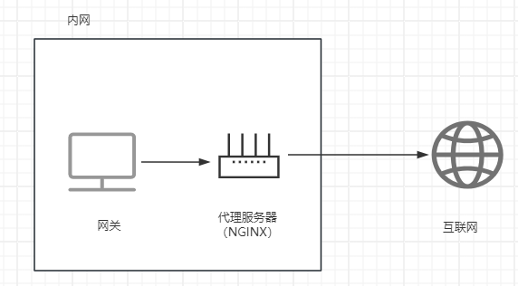
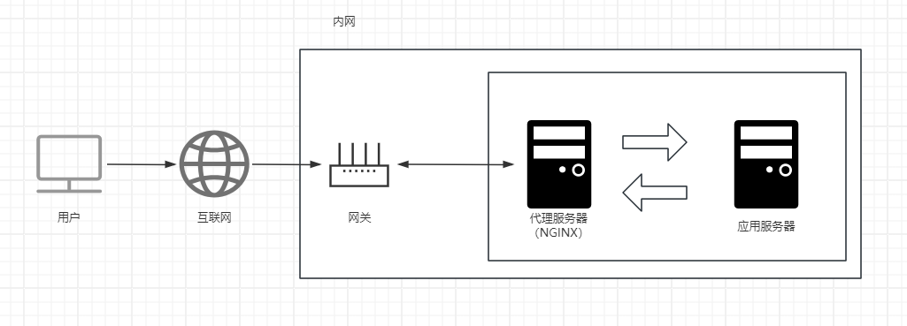

# 代理服务

##  正向代理

客户端通过代理服务器能够访问外网（可以认为是对外隐藏客户端）

 


##  反向代理

反向代理服务器代理用户的请求访问应用服务器，应用服务器将响应数据给反向代理服务器，再转发给用户（可以认为是对外隐藏服务器）

 


##  代理模型

1、隧道式模型（服务器完全在内网环境）

所有请求与响应都会通过代理服务器，消耗代理服务器的带宽。当并发请求量大时，响应速度将大打折扣

2、DR模型 （服务器不完全再内网环境）

所有请求通过代理服务器，响应直接由服务器转给网关，再将其响应客户端


##  配置语法

[ngx_http_proxy_module](https://nginx.org/en/docs/http/ngx_http_proxy_module.html)

**proxy_pass：** 配置代理

```shell
proxy_pass URL # 作用域：location
```

```shell
# 两种方式效果一样
location / {
	# proxy_pass http://www.example.com;
	# proxy_pass http://www.example.com/;
}
```

```shell
# 访问 /server
# 第一种，它会去寻找http://www.example.com/server/index.html
# 第二种，它会去寻找 http://www.example.com/index.html
location /server {
	# proxy_pass http://www.example.com;
	# proxy_pass http://www.example.com/;
}
```

```bash
# proxy_pass 与 root 二选一
location / {
	proxy_pass http://www.example.com/; 
	# 地址需要是完整的，假如缺少www则结果将是地址重定向
}
```


**proxy_set_header：** 自定义请求头信息传递给服务器

```shell
proxy_set_header field value
# 作用域 
http、server、location
# 默认值
proxy_set_header Host $http_host
proxy_set_header Connection close
```

```shell
# 代理服务器
location / {
	proxy_pass http://www.example.com
	proxy_set_header x_custom_header $http_host;
}

# 服务器
location / {
	listen 80;
	server_name localhost;
	default_type text/plain;
	return 200 '$http_x_custom_header' # $http_自定义请求头名
}
```

**proxy_redirect：** 重写服务器的请求头Location的值，防止服务器直接暴露

```shell
proxy_redirect off|default|redirect replacement

# 作用域
http、server、location
# 默认值
proxy_redirect default

default: 将proxy_pass作为redirect，将Location作为replacement
```

```shell
# 服务器 http://192.168.9.200
server {
	listen 80;
	server_name localhost;
	if (!-f $request_filename) {
		return 302 http://192.168.9.200
	}
}

# 代理服务器 http://192.168.9.100
location / {
	proxy_pass http://192.168.9.200;
	proxy_redirect http://192.168.9.200 http://192.168.9.100;
}
```

