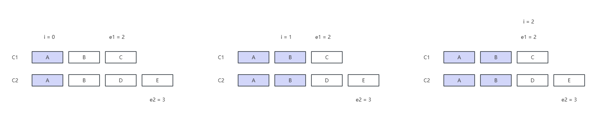
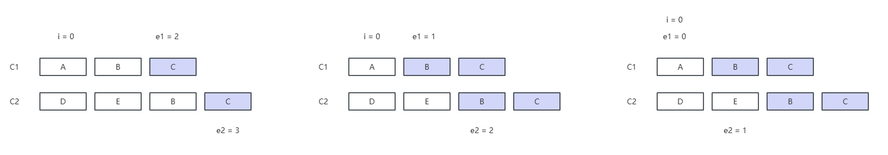
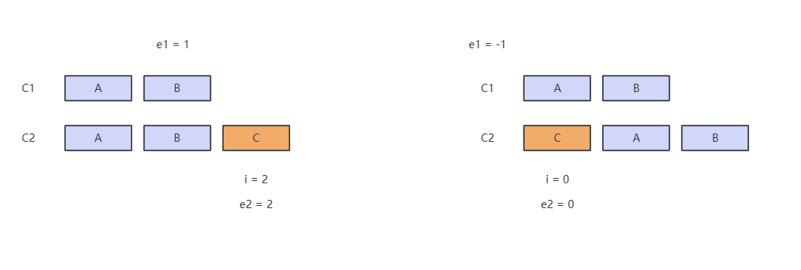
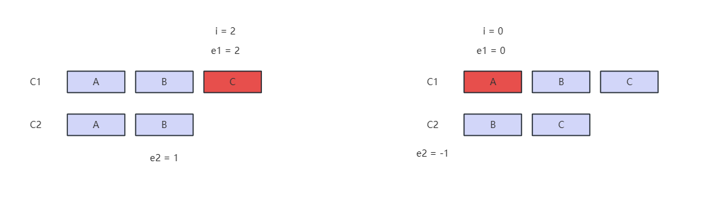
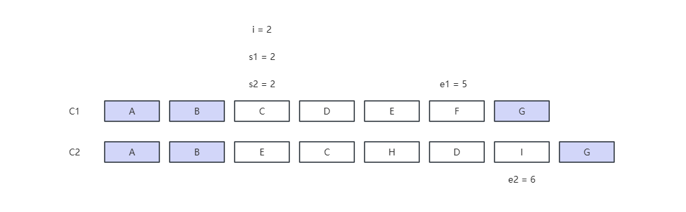
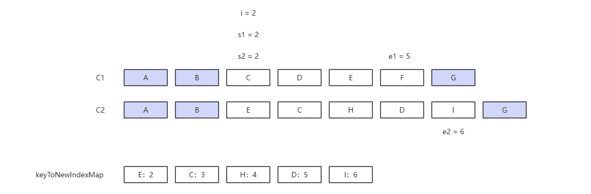
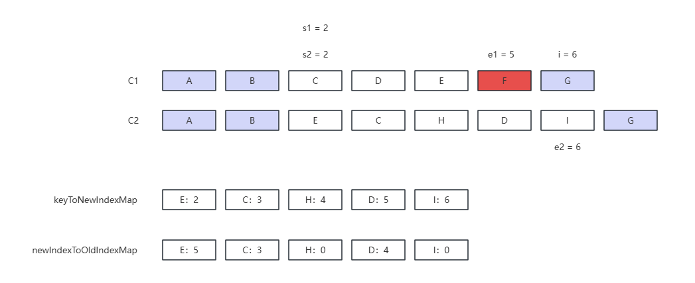
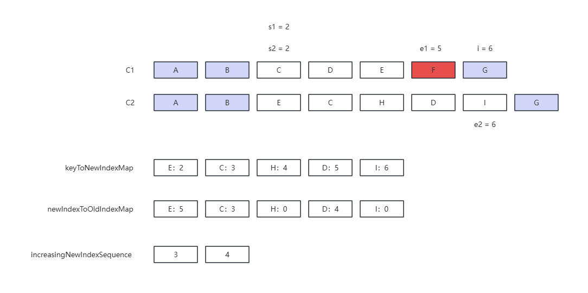

# DIFF

Diff 算法是一种用于比较两个序列（如字符串、数组或列表）并找出它们之间差异的算法。在计算机科学中，Diff 算法广泛应用于版本控制系统（如 Git）、文本编辑器（如 Vim 和 Emacs）以及数据同步等领域。

在 Vue.js 中，Diff 算法主要用于虚拟 DOM 的比较和更新。Vue.js 使用虚拟 DOM 来提高性能，因为直接操作 DOM 是非常昂贵的。虚拟 DOM 是一个轻量级的 JavaScript 对象，它代表了真实的 DOM 结构。当组件的状态发生变化时，Vue.js 会生成一个新的虚拟 DOM，然后使用 Diff 算法比较新旧虚拟 DOM 的差异，最后只更新那些实际发生变化的 DOM 节点。


## 前比较

c1：旧节点数组

c2：新节点数组

e1：旧数组尾指针，依次向前移动

e2：新数组尾指针，依次向前移动

i：新旧数组前指针，依次同步向后移动

```ts
// patchKeyedChildren DIFF
let i = 0
const l2 = c2.length
let e1 = c1.length - 1
let e2 = l2 - 1
```

```ts
// 1. sync from start
// (a b) c
// (a b) d e
while (i <= e1 && i <= e2) {
  const n1 = c1[i]
  const n2 = (c2[i] = optimized
              ? cloneIfMounted(c2[i] as VNode)
              : normalizeVNode(c2[i]))
  if (isSameVNodeType(n1, n2)) {
    patch(
      n1,
      n2,
      container,
      null,
      parentComponent,
      parentSuspense,
      namespace,
      slotScopeIds,
      optimized,
    )
  } else {
    break
  }
  i++
}
```

 


## 后比较

```ts
// 2. sync from end
// a (b c)
// d e (b c)
while (i <= e1 && i <= e2) {
  const n1 = c1[e1]
  const n2 = (c2[e2] = optimized
              ? cloneIfMounted(c2[e2] as VNode)
              : normalizeVNode(c2[e2]))
  if (isSameVNodeType(n1, n2)) {
    patch(
      n1,
      n2,
      container,
      null,
      parentComponent,
      parentSuspense,
      namespace,
      slotScopeIds,
      optimized,
    )
  } else {
    break
  }
  e1--
  e2--
}
```

 


## 仅新增

```ts
// 3. common sequence + mount
// (a b)
// (a b) c
// i = 2, e1 = 1, e2 = 2
// (a b)
// c (a b)
// i = 0, e1 = -1, e2 = 0
if (i > e1) {
  if (i <= e2) {
    const nextPos = e2 + 1
    const anchor = nextPos < l2 ? (c2[nextPos] as VNode).el : parentAnchor
    while (i <= e2) {
      patch(
        null,
        (c2[i] = optimized
         ? cloneIfMounted(c2[i] as VNode)
         : normalizeVNode(c2[i])),
        container,
        anchor,
        parentComponent,
        parentSuspense,
        namespace,
        slotScopeIds,
        optimized,
      )
      i++
    }
  }
}
```

 


## 仅删除

```ts
// 4. common sequence + unmount
// (a b) c
// (a b)
// i = 2, e1 = 2, e2 = 1
// a (b c)
// (b c)
// i = 0, e1 = 0, e2 = -1
else if (i > e2) {
  while (i <= e1) {
    unmount(c1[i], parentComponent, parentSuspense, true)
    i++
  }
}
```

  


## 其它情况

可能同时存在新增、删除、移动

```ts
// 5. unknown sequence
// [i ... e1 + 1]: a b [c d e] f g
// [i ... e2 + 1]: a b [e d c h] f g
// i = 2, e1 = 4, e2 = 5

const s1 = i // prev starting index
const s2 = i // next starting index
```

经过上述步骤，结果如图所示：

 

创建`keyToNewIndexMap`保存新数组节点中与旧节点数组差异的部分

```ts
// 5.1 build key:index map for newChildren
const keyToNewIndexMap: Map<PropertyKey, number> = new Map()
for (i = s2; i <= e2; i++) {
  const nextChild = (c2[i] = optimized
                     ? cloneIfMounted(c2[i] as VNode)
                     : normalizeVNode(c2[i]))
  if (nextChild.key != null) {
    if (__DEV__ && keyToNewIndexMap.has(nextChild.key)) {
      warn(
        `Duplicate keys found during update:`,
        JSON.stringify(nextChild.key),
        `Make sure keys are unique.`,
      )
    }
    keyToNewIndexMap.set(nextChild.key, i)
  }
}
```

 

1、创建数组`newIndexToOldIndexMap`，长度为新节点数组差异部分，初始化为0

循环旧节点数组，`keyToNewIndexMap`获取旧节点在新节点数组中所对应的索引值

如果旧节点不存在`key`则循环新节点数组差异部分，比较新旧节点，尝试获取索引值

如果都找不到索引信息，说明该节点在新节点数组中不存在需要卸载

如果找到索引信息，`newIndexToOldIndexMap`保存当前节点在旧节点数组中所应对的索引值

2、每次找到索引值，`patched++`，表示已复用旧节点并对其打补丁

`patched >= newIndexToOldIndexMap`，表示所有可复用节点都已打补丁，其余的节点直接卸载

3、每次找到索引值， `newIndex >= maxNewIndexSoFar => maxNewIndexSoFar = newIndex`

后续节点处理中，如果存在小于该位置的索引，表示存在旧节点可以复用但是需要将其移动

```ts
// 5.2 loop through old children left to be patched and try to patch
// matching nodes & remove nodes that are no longer present
let j
let patched = 0
const toBePatched = e2 - s2 + 1
let moved = false
// used to track whether any node has moved
let maxNewIndexSoFar = 0
// works as Map<newIndex, oldIndex>
// Note that oldIndex is offset by +1
// and oldIndex = 0 is a special value indicating the new node has
// no corresponding old node.
// used for determining longest stable subsequence
const newIndexToOldIndexMap = new Array(toBePatched)
for (i = 0; i < toBePatched; i++) newIndexToOldIndexMap[i] = 0

for (i = s1; i <= e1; i++) {
  const prevChild = c1[i]
  if (patched >= toBePatched) {
    // all new children have been patched so this can only be a removal
    unmount(prevChild, parentComponent, parentSuspense, true)
    continue
  }
  let newIndex
  if (prevChild.key != null) {
    newIndex = keyToNewIndexMap.get(prevChild.key)
  } else {
    // key-less node, try to locate a key-less node of the same type
    for (j = s2; j <= e2; j++) {
      if (
        newIndexToOldIndexMap[j - s2] === 0 &&
        isSameVNodeType(prevChild, c2[j] as VNode)
      ) {
        newIndex = j
        break
      }
    }
  }
  if (newIndex === undefined) {
    unmount(prevChild, parentComponent, parentSuspense, true)
  } else {
    newIndexToOldIndexMap[newIndex - s2] = i + 1
    if (newIndex >= maxNewIndexSoFar) {
      maxNewIndexSoFar = newIndex
    } else {
      moved = true
    }
    patch(
      prevChild,
      c2[newIndex] as VNode,
      container,
      null,
      parentComponent,
      parentSuspense,
      namespace,
      slotScopeIds,
      optimized,
    )
    patched++
  }
}
```

  

经过上述步骤，可复用的节点均已打补丁，不需要的节点已卸载

`newIndexToOldIndexMap`最长递增子序列可通过该数组保存的索引值获取

`newIndexToOldIndexMap`索引为0表示旧节点数组中不存在，可以直接挂载

::: tip 

最长递增子序列是一种优化手段，此处可以尽可能少的移动节点从而达到最终的结果

:::

```ts
// 5.3 move and mount
// generate longest stable subsequence only when nodes have moved
const increasingNewIndexSequence = moved
? getSequence(newIndexToOldIndexMap)
: EMPTY_ARR
j = increasingNewIndexSequence.length - 1
// looping backwards so that we can use last patched node as anchor
for (i = toBePatched - 1; i >= 0; i--) {
  const nextIndex = s2 + i
  const nextChild = c2[nextIndex] as VNode
  const anchor =
        nextIndex + 1 < l2 ? (c2[nextIndex + 1] as VNode).el : parentAnchor
  if (newIndexToOldIndexMap[i] === 0) {
    // mount new
    patch(
      null,
      nextChild,
      container,
      anchor,
      parentComponent,
      parentSuspense,
      namespace,
      slotScopeIds,
      optimized,
    )
  } else if (moved) {
    // move if:
    // There is no stable subsequence (e.g. a reverse)
    // OR current node is not among the stable sequence
    if (j < 0 || i !== increasingNewIndexSequence[j]) {
      move(nextChild, container, anchor, MoveType.REORDER)
    } else {
      j--
    }
  }
}
```

 

## Unkeyed

比较新旧节点数组的长度，获取最小数组长度

以最小长度为循环终止条件，比较更新同位置的节点

旧节点数组长度大于新数组长度，将旧节点数组最小长度以后的节点卸载

旧节点数组长度小于新数组长度，将新节点数组最小长度以后的节点挂载

```ts
// patchUnKeyedChildren
c1 = c1 || EMPTY_ARR
c2 = c2 || EMPTY_ARR
const oldLength = c1.length
const newLength = c2.length
const commonLength = Math.min(oldLength, newLength)
let i
for (i = 0; i < commonLength; i++) {
  const nextChild = (c2[i] = optimized
                     ? cloneIfMounted(c2[i] as VNode)
                     : normalizeVNode(c2[i]))
  patch(
    c1[i],
    nextChild,
    container,
    null,
    parentComponent,
    parentSuspense,
    namespace,
    slotScopeIds,
    optimized,
  )
}
if (oldLength > newLength) {
  // remove old
  unmountChildren(
    c1,
    parentComponent,
    parentSuspense,
    true,
    false,
    commonLength,
  )
} else {
  // mount new
  mountChildren(
    c2,
    container,
    anchor,
    parentComponent,
    parentSuspense,
    namespace,
    slotScopeIds,
    optimized,
    commonLength,
  )
}
```

