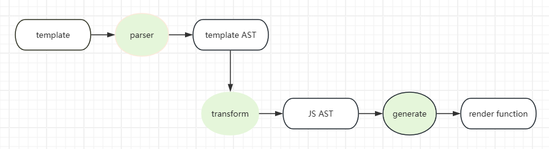

# 开始准备

Vue三大核心系统：Compiler、Runtime、Reactivity 

```
packages/
├── compiler-core
├── compiler-dom
├── compiler-sfc
└── compiler-ssr
├── reactivity
├── runtime-core
├── runtime-dom
├── server-renderer
├── shared

`compiler-core`： 核心编译器代码
`compiler-dom`：DOM 编译器代码
`compiler-sfc`：单文件组件编译器代码
`compiler-ssr`：服务器端渲染编译器代码
`reactivity`：响应式系统代码
`runtime-core`：核心运行时代码
`runtime-dom`:DOM 运行时代码
`server-renderer`：服务器端渲染代码
`shared`：共享代码
```

 

## VNode

虚拟DOM是一种编程概念，用于在JavaScript中模拟DOM结构，它包含了与实际DOM节点相对应的属性和状态信息，是对真实DOM的抽象。

1. **轻量级**：内存中维护一个轻量级的 DOM 树来优化真实 DOM 的操作
2. **抽象层**：开发者可以更专注于业务逻辑，而不需要关心具体的 DOM 操作
3. **批量更新**：将多个数据变化合并成一次 DOM 更新，这样可以减少浏览器的重绘和回流
4. **跨平台**：开发者可以使用相同的代码库在不同的平台上运行应用
5. **优化渲染性能**：通过DIFF算法比较新旧虚拟 DOM 树差异，只更新变化的部分，减少DOM 操作


## Compiler

编译器（Compiler）的作用是将模板（Template）转换为渲染函数（Render Function）

1. **模板解析**：编译器首先会将模板（Template）解析成抽象语法树（AST）。抽象语法树是一种树形数据结构，它表示了模板的结构和内容。例如，模板中的每个元素、属性、文本等都会被解析成 AST 中的一个节点。
2. **指令解析**：编译器会解析模板中的指令（Directive），如 v-if、v-for、v-bind。指令是  Vue中用于绑定数据和 DOM 元素的特殊标记。编译器会将指令解析成对应的操作，以便在渲染函数中使用。
3. **静态节点优化**：编译器会识别模板中的静态节点，并将它们标记为静态。静态节点是指那些在渲染过程中不会发生变化的节点。编译器会将静态节点提取出来，以便在渲染函数中直接使用，从而减少不必要的计算和 DOM 操作。
4. **生成渲染函数**：编译器会将解析后的模板和指令转换成渲染函数。渲染函数是一个函数，它接收组件的上下文（context）作为参数，并返回一个虚拟 DOM 树。渲染函数是  Vue 中用于生成虚拟 DOM 的核心函数。

  

## Reactivity

 在 Vue中，响应式是指可以自动追踪数据的变化，并在数据变化时更新视图。

1. **依赖收集**：当组件渲染时，会访问组件的数据，这时  Vue 会将这些数据标记为依赖。当数据发生变化时， Vue 会通知这些依赖进行更新。
2. **派发更新**：当数据发生变化时， Vue 会通知所有依赖于该数据的组件进行更新。这是通过调用组件的更新函数实现的。
3. **异步更新队列**： Vue 会将所有的数据变化合并成一次更新，以减少浏览器的重绘和回流，提高性能。这是通过使用异步更新队列实现的。
4. **计算属性**：计算属性是基于响应式数据的一种特殊属性，它的值会根据依赖的数据自动更新。计算属性可以缓存计算结果，只有当依赖的数据发生变化时才会重新计算。
5. **侦听器**：侦听器是  Vue 中用于监听数据变化的一种机制。当数据发生变化时，侦听器会自动执行相应的回调函数。

  


## renderer

在Vue中，渲染器（Renderer）的作用是将Vue组件渲染为真实的DOM元素。 

1. 服务器端渲染器：服务器端渲染器将Vue组件渲染为HTML字符串，然后将HTML字符串发送到客户端。客户端接收到HTML字符串后，将其转换为DOM元素，并插入到页面中。服务器端渲染器可以提高页面的首屏加载速度，因为服务器端已经生成了完整的HTML页面。
2. 客户端渲染器：客户端渲染器将Vue组件渲染为真实DOM，并将真实DOM插入到页面中。客户端渲染器可以在页面加载后动态更新页面内容，实现页面的动态交互。

 