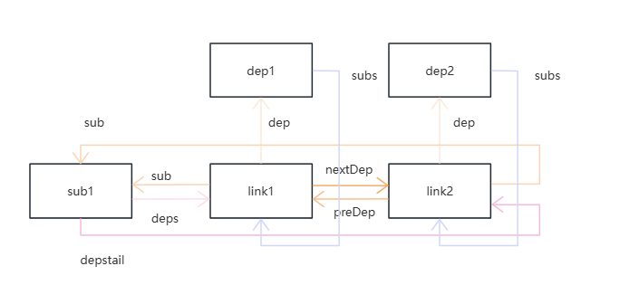
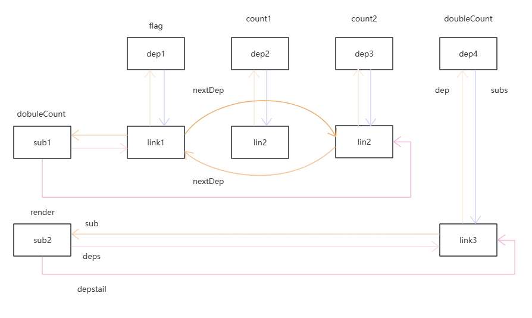

# 响应式原理

Vue3.5响应式重构主要分为两部分：双向链表、版本计数

订阅者（Sub）：主要有 watch、watchEffect、render、computed..

依赖（Dep）：主要有 ref、reactive、computed...

节点（Link）：链接订阅者和依赖之间的桥梁

::: tip 计算属性即是订阅者也是依赖

计算属性的返回值可当作普通响应式变量使用 

计算属性可以监听使用的响应式变量，响应式改变后触发回调

:::


::: tip 订阅者

所有订阅者底层都是通过 `ReactiveEffect` 实现的

:::


## 模型对比

以下代码作为示例，展示最终的模型

```ts
let sum1, sum2

//Dep1
const counter1 = ref(1)

//Dep2
const counter2 = ref(2)

//Sub1
watchEffect(() => {
  sum1 = counter1.value + counter2.value
})

//Sub2
watchEffect(() => {
  sum2 = counter1.value + counter2.value + 1
})

counter1.value++
counter2.value++
```


以前的模型：

 

现在的模型：

    

```ts
// 订阅者
export interface Subscriber {
  // 依赖链表头部
  deps?: Link
  // 依赖链表尾部
  depsTail?: Link
  
  flags: EffectFlags
  notify(): void
}

// 依赖链接
export interface Link {
  // 依赖项
  dep: Dep
  // 订阅者
  sub: Subscriber

  version: number

  // 依赖项链表（x轴）
  nextDep?: Link
  prevDep?: Link

  // 订阅者链表（Y轴）
  nextSub?: Link
  prevSub?: Link
  
  prevActiveLink?: Link
}
```


## 依赖存储

```ts
// 键：响应式对象的属性，值：相关依赖（副作用函数）
type KeyToDepMap = Map<any, Dep>
// 键：响应式代理对象，值：响应式对象的属性对应的Map
const targetMap = new WeakMap<object, KeyToDepMap>()
```

  

```ts
// 响应式变量调用getter时会触发依赖收集
export function track(target: object, type: TrackOpTypes, key: unknown): void {
  if (shouldTrack && activeSub) {
    let depsMap = targetMap.get(target)
    if (!depsMap) {
      targetMap.set(target, (depsMap = new Map()))
    }
    let dep = depsMap.get(key)
    if (!dep) {
      depsMap.set(key, (dep = new Dep()))
      dep.map = depsMap
      dep.key = key
    }  
     dep.track()
  }
}
```


## 依赖收集

```ts
class Dep {
  version = 0
  activeLink?: Link = undefined
  // 依赖l
  subs?: Link = undefined
  map?: KeyToDepMap = undefined
  key?: unknown = undefined
  // 订阅者数量
  sc: number = 0

  track() {
    if (!activeSub || !shouldTrack || activeSub === this.computed) {
      return
    }

    let link = this.activeLink
    // 分支一
    if (link === undefined || link.sub !== activeSub) {
      // 步骤一
      link = this.activeLink = new Link(activeSub, this)

      // 步骤二
      if (!activeSub.deps) {
        activeSub.deps = activeSub.depsTail = link
      } else {
        link.prevDep = activeSub.depsTail
        activeSub.depsTail!.nextDep = link
        activeSub.depsTail = link
      }
			
      // 步骤三
      addSub(link)
    }
    
    // 分支二
    else if (link.version === -1) { 
      // ... 
    }
  }
}
```

```ts
function addSub(link: Link) {
  link.dep.sc++
  if (link.sub.flags & EffectFlags.TRACKING) {
    // 省略 computed..

    const currentTail = link.dep.subs
    if (currentTail !== link) {
      link.prevSub = currentTail
      if (currentTail) currentTail.nextSub = link
    }

    link.dep.subs = link
  }
}
```


以下代码为示例，展示依赖收集的过程

```ts
let sum1, sum2

// Dep1
const counter1 = ref(1)

// Dep2
const counter2 = ref(2)

// Sub1
watchEffect(() => {
  sum1 = counter1.value + counter2.value
})

// Sub2
watchEffect(() => {
  sum2 = counter1.value + counter2.value + 1
})
```

订阅者`Sub1`收集依赖`Dep1`

```
1、分支一：dep1.activeLink = undefined, activeSub = sub1

2、步骤一：创建 link1，依赖为Dep1，订阅者为Sub1，dep1.activeLink = link1

3、步骤二：此时Sub1并未与任何依赖关联，满足条件 !activeSub.deps
	activeSub.deps = activeSub.depsTail = link

4、步骤三：Sub1未收集依赖Dep1，执行addSub

5、addSub：此时 currentTail = undefined，link = link1
	link.prevSub = currentTail 
	link.dep.subs = link
```

 

订阅者`Sub1`收集依赖`Dep2`

```
1、分支一：dep2.activeLink = undefined, activeSub = sub1

2、步骤一：创建 link2，依赖为Dep1，订阅者为Sub1，dep2.activeLink = link2

3、步骤二：此时Sub1已经存在依赖Dep1，关联link1和link2
	link.prevDep = activeSub.depsTail
	activeSub.depsTail!.nextDep = link
	activeSub.depsTail = link

4、步骤三：Sub1未收集依赖Dep2，执行addSub

5、addSub：此时 currentTail = undefined，link = link2
	link.prevSub = currentTail 
	link.dep.subs = link
```

 

订阅者`Sub2`收集依赖`Dep1`

```ts
1、分支一：dep1.activeLink = link1，link1.sub = sub1，activeSub = sub2

2、步骤一：创建 link3，依赖为Dep1，订阅者为Sub2

3、步骤二：此时Sub2并未与任何依赖关联，满足条件 !activeSub.deps
	activeSub.deps = activeSub.depsTail = link

4、步骤三：Sub2未收集依赖Dep1，执行addSub

5、addSub：此时 currentTail = link1，link = link3
	link.prevSub = currentTail
	if (currentTail) currentTail.nextSub = link
	link.dep.subs = link
```

 

订阅者`Sub2`收集依赖`Dep2`

```
1、分支一：dep2.activeLink = link2，link2.sub = sub1，activeSub = sub2

2、步骤一：创建 link4，依赖为Dep2，订阅者为Sub2

3、步骤二：此时Sub2已经存在依赖Dep1，关联link3和link4
	link.prevDep = activeSub.depsTail
	activeSub.depsTail!.nextDep = link
	activeSub.depsTail = link

4、步骤三：Sub2未收集依赖Dep2，执行addSub

5、addSub：此时 currentTail = link2，link = link4
	link.prevSub = currentTail
	if (currentTail) currentTail.nextSub = link
	link.dep.subs = link
```

  


## 依赖触发

版本计数：追踪响应式对象内部变化的机制，版本计数共分为以下几部分：

全局版本`globalVersion`：初始值零，仅在响应式变量改变后递增

依赖版本 `dep.version`：初始值零，仅当响应式对象属性改变后递增

节点版本`link.version`：初始值零，更新前比较依赖版本判断是否要更新，更新后同步依赖版本

计算属性版本`computed.globalVersion`：该版本等于全局版本，表示计算属性回调无需重新执行

```vue
<template>
  <p>{{ doubleCount }}</p>
  <button @click="flag = !flag">切换flag</button>
  <button @click="count1++">count1++</button>
  <button @click="count2++">count2++</button>
</template>

<script setup>
const count1 = ref(1)
const count2 = ref(10)
const flag = ref(true)

const doubleCount = computed(() => {
  if (flag.value) {
    return count1.value * 2
  } else {
    return count2.value * 2
  }
})
</script>
```

依赖收集后，响应式模型如下

```ts
class Dep {
    track() {
    if (!activeSub || !shouldTrack || activeSub === this.computed) {
      return
    }

    let link = this.activeLink
    if (link === undefined || link.sub !== activeSub) {
      link = this.activeLink = new Link(activeSub, this)

      if (!activeSub.deps) {
        activeSub.deps = activeSub.depsTail = link
      } else {
        link.prevDep = activeSub.depsTail
        activeSub.depsTail!.nextDep = link
        activeSub.depsTail = link
      }
	
      addSub(link)
    }
}
```

 

执行 `count1++`，触发响应式变量的 `set`拦截

```ts
class RefImpl {
  dep: Dep = new Dep();
  get value() {
    this.dep.track()
  }
  set value() {
    this.dep.trigger()
  }
}
```

执行依赖的 `trigger`，全局版本：`globalVersion = 1`，依赖版本：`dep.version = 1`

```ts
trigger() {
  this.version++
  globalVersion++
  this.notify()
}
```

执行依赖的 `notify`，遍历依赖的订阅者，通知订阅者响应式变量发生改变需要重新执行 

```ts
notify() {
    startBatch()
    try {
      for (let link = this.subs; link; link = link.prevSub) {
        if (link.sub.notify()) {
          // if notify() returns `true`, this is a computed. Also call notify
          // on its dep - it's called here instead of inside computed's notify
          // in order to reduce call stack depth.
          ;(link.sub as ComputedRefImpl).dep.notify()
        }
      }
    } finally {
      endBatch()
    }
  }
```

执行订阅者的 `notify`，创建需要批量执行的订阅者链表，向链表头部添加订阅者

```ts
class ReactiveEffect implements Subscriber, ReactiveEffectOptions {
  notify() {
    // ...
    batch(this)
  }
}
```

```ts
// 批量深度
let batchDepth = 0
// 批量订阅者链（非计算属性）
let batchedSub: Subscriber | undefined
// 批量计算属性链
let batchedComputed: Subscriber | undefined

export function batch(sub: Subscriber, isComputed = false): void {
  sub.flags |= EffectFlags.NOTIFIED
  if (isComputed) {
    sub.next = batchedComputed
    batchedComputed = sub
    return
  }
  sub.next = batchedSub
  batchedSub = sub
}
```

如果订阅者是计算属性，需要执行计算属性本身的 `notify`，将其添加到批量订阅者链表头部

```ts
export class ComputedRefImpl<T = any> implements Subscriber {
  notify(): true | void {
    // 修改标志位为1，表示需要重新计算
    this.flags |= EffectFlags.DIRTY
    if (
      // 当前依赖项未被通知过且当前订阅者不是自身
      !(this.flags & EffectFlags.NOTIFIED) &&
      // avoid infinite self recursion
      activeSub !== this
    ) {
      batch(this, true)
      return true
    }
  }
}
```

::: tip 计算属性优化

计算属性作为订阅者时并不会像其它订阅者会直接重新执行

它会通知它的订阅者，此时才会执行计算属性中的回调函数

:::

```ts
notify() {
    startBatch()
    try {
      for (let link = this.subs; link; link = link.prevSub) {
        if (link.sub.notify()) {
          // if notify() returns `true`, this is a computed. Also call notify
          // on its dep - it's called here instead of inside computed's notify
          // in order to reduce call stack depth.
          ;(link.sub as ComputedRefImpl).dep.notify()
        }
      }
    } finally {
      endBatch()
    }
  }
```

```ts
export function startBatch(): void {
  batchDepth++
}
```

```
batchDep = 1
batchedSub：undefined
batchedComputed: doubleCount
```

计算属性作为依赖会通知它的订阅者`(render)`

```
batchDep = 2
batchedSub：render
batchedComputed: doubleCount
```

批量订阅者链表开始执行，调用 `endBatch`，深度大于零返回上一层

```ts
export function endBatch(): void {
  if (--batchDepth > 0) {
    return
  }
}
```

```
batchDep = 1
batchedSub：render
batchedComputed: doubleCount
```

继续遍历 `count1`的订阅者链，发现已经遍历完成，调用 `endBatch`，此层级处于最顶层

```ts
export function endBatch(): void {
  if (batchedComputed) {
    let e: Subscriber | undefined = batchedComputed
    batchedComputed = undefined
    while (e) {
      const next: Subscriber | undefined = e.next
      e.next = undefined
      e.flags &= ~EffectFlags.NOTIFIED
      e = next
    }
  }
}

```

```
1、保存批量计算属性链表
2、全局变量batchedComputed置空，以便其它依赖的计算属性订阅者使用
3、遍历链表，重置通知标志位，表示计算属性作为订阅者已经重新执行了
```

```ts
export function endBatch(): void {
  let error: unknown
  while (batchedSub) {
    let e: Subscriber | undefined = batchedSub
    batchedSub = undefined
    while (e) {
      const next: Subscriber | undefined = e.next
      e.next = undefined
      e.flags &= ~EffectFlags.NOTIFIED
      if (e.flags & EffectFlags.ACTIVE) {
        try {
          // ACTIVE flag is effect-only
          ;(e as ReactiveEffect).trigger()
        } catch (err) {
          if (!error) error = err
        }
      }
      e = next
    }
  }

  if (error) throw error
}
```

```
1、保存批量订阅者链表
2、全局变量batchedSub置空，以便其它依赖的非计算属性订阅者使用
3、遍历链表，重置通知标志位，表示订阅者已经重新执行了
```

调用订阅者的 `trigger` 重新执行

```ts
class ReactiveEffect implements Subscriber, ReactiveEffectOptions {
  trigger(): void { 
    // ...
    this.runIfDirty()
  }
  
  runIfDirty(): void {
    if (isDirty(this)) {
      this.run()
    }
  }
}
```

通过版本比较，判断是否需要重新执行

```ts
function isDirty(sub: Subscriber): boolean {
  for (let link = sub.deps; link; link = link.nextDep) {
    if (
      link.dep.version !== link.version ||
      (link.dep.computed &&
        (refreshComputed(link.dep.computed) ||
          link.dep.version !== link.version))
    ) {
      return true
    }
  }
  
  return false
}
```

```ts
count1++

每次响应式变量修改都会触发set方法，从而修改 dep.version++
此时link.version还未同步，满足条件一执行重新执行

订阅者的依赖是计算属性时，此时并未调用 dep.trigger 修改 dep.version，条件一无法满足
refreshComputed执行计算属性回调，计算结果改变时修改 dep.version++，重新执行 render
```

调用`refreshComputed` 判断计算属性是否需要重新执行回调

```ts
export class ComputedRefImpl<T = any> implements Subscriber {
    readonly dep: Dep = new Dep(this)
  	// 默认值如此设置是为了能够第一次时执行回调
    globalVersion: number = globalVersion - 1
  
    get value(): T {
    const link = this.dep.track()
    refreshComputed(this)
    if (link) {
      link.version = this.dep.version
    }
    return this._value
  }
}
```

```ts
export function refreshComputed(computed: ComputedRefImpl): undefined {
  // 计算属性版本比较全局版本
  // 全局版本每一响应式变量改变时，都会被修改
  if (computed.globalVersion === globalVersion) {
    return
  }
  
  // 版本同步
  computed.globalVersion = globalVersion
  
  // 通过比较依赖的版本号是否一致，判断计算属性是否需要重新执行回调
  const dep = computed.dep
  if (
    dep.version > 0 &&
    computed.deps &&
    !isDirty(computed)
  ) {
    return
  }

  try {
    // 更新计算属性依赖
    prepareDeps(computed)
    // 重新执行回调
    const value = computed.fn(computed._value)
    // 比较新旧值
    if (dep.version === 0 || hasChanged(value, computed._value)) {
      computed._value = value
      dep.version++
    }
  } catch (err) {
    dep.version++
  } finally {
    // 清除未使用的依赖
    cleanupDeps(computed)
  }
}
```


## 依赖更新

订阅者和依赖的关系并非固定，每次订阅者重新执行都有可能收集新的依赖、删除已有的依赖

以之前示例代码为例，改变 `flag = false`，将会导致计算属性回调重新执行，更新依赖

```ts
const doubleCount = computed(() => {
  if (flag.value) {
    return count1.value * 2
  } else {
    return count2.value * 2
  }
})
```

 

订阅者更新依赖前会初始化上次的`Link`，将其`Link`版本都重置为 `-1`

```ts
function prepareDeps(sub: Subscriber) {
  // Prepare deps for tracking, starting from the head
  for (let link = sub.deps; link; link = link.nextDep) {
    // set all previous deps' (if any) version to -1 so that we can track
    // which ones are unused after the run
    link.version = -1
    // store previous active sub if link was being used in another context
    link.prevActiveLink = link.dep.activeLink
    link.dep.activeLink = link
  }
}
```

订阅者重新执行，再次收集相关依赖，这一次相关依赖只有 `flag、count2`

```ts
class Dep {
    track() {
    if (!activeSub || !shouldTrack || activeSub === this.computed) {
      return
    }

    let link = this.activeLink
    if (link === undefined || link.sub !== activeSub) {
      link = this.activeLink = new Link(activeSub, this)

      if (!activeSub.deps) {
        activeSub.deps = activeSub.depsTail = link
      } else {
        link.prevDep = activeSub.depsTail
        activeSub.depsTail!.nextDep = link
        activeSub.depsTail = link
      }
	
      addSub(link)
    }
}
```

 

假设此时订阅者对 `count1` 还存在依赖，它将会执行以下操作

```ts
class Dep {
    track() {
    if (!activeSub || !shouldTrack || activeSub === this.computed) {
      return
    }

    let link = this.activeLink
    
    // ...
    else if (link.version === -1) {
      // link 同步 dep 版本
      link.version = this.version

      // link移动到链尾，保证依赖的列表顺序是正确的
      if (link.nextDep) {
        const next = link.nextDep
        next.prevDep = link.prevDep
        if (link.prevDep) {
          link.prevDep.nextDep = next
        }

        link.prevDep = activeSub.depsTail
        link.nextDep = undefined
        activeSub.depsTail!.nextDep = link
        activeSub.depsTail = link

        // 如果link原本是链头，则新的链同指向它的下一个节点
        if (activeSub.deps === link) {
          activeSub.deps = next
        }
      }
    }
}
```

最后执行依赖清除，`link.version = -1`，表示该依赖在此次收集过程并未再次使用

```ts
function cleanupDeps(sub: Subscriber) {
  let head
  let tail = sub.depsTail
  let link = tail
  while (link) {
    const prev = link.prevDep
    if (link.version === -1) {
      if (link === tail) tail = prev
      // unused - remove it from the dep's subscribing effect list
      removeSub(link)
      // also remove it from this effect's dep list
      removeDep(link)
    } else {
      // The new head is the last node seen which wasn't removed
      // from the doubly-linked list
      head = link
    }

    // restore previous active link if any
    link.dep.activeLink = link.prevActiveLink
    link.prevActiveLink = undefined
    link = prev
  }
  // set the new head & tail
  sub.deps = head
  sub.depsTail = tail
}
```

 


## 响应式存储

不同类型的代理对象都有相对应的Map存储，对已代理的对象做缓存，提高性能

```ts
export const reactiveMap: WeakMap<Target, any> = new WeakMap<Target, any>()
export const shallowReactiveMap: WeakMap<Target, any> = new WeakMap<
  Target,
  any
>()
export const readonlyMap: WeakMap<Target, any> = new WeakMap<Target, any>()
export const shallowReadonlyMap: WeakMap<Target, any> = new WeakMap<
  Target,
  any
>()
```

```ts
const obj = {}

const a = reactive(obj)
const b = reactive(obj)
const c = ref(obj)
const d = ref(obj)

// 同一个原始对象经过reactive、ref，返回同一个代理对象
console.log(a === b) // true
console.log(a === c.value) // true
console.log(c.value === d.value) // true


// 同一个代理对象，不论经过多少次的ref、reactive，返回同一个代理对象
const f = ref(a)
const g = reactive(b)
console.log(f.value === a) // true
console.log(g === b) // true
console.log(f.value === g) // true
```


## 响应式类型

`ref、reactive、shallowRef、shallowReactive` 

定义的变量将会转为响应式变量，它们的底层实现 `createReactiveObject`

```ts
class RefImpl<T = any> {
  _value: T
  private _rawValue: T

  dep: Dep = new Dep()

  // 浅层响应式对象只对其自身的属性进行响应式处理，不递归处理其嵌套属性
  constructor(value: T, isShallow: boolean) {
    // 响应式对象的原始值
    this._rawValue = isShallow ? value : toRaw(value)
    // 响应式对象，非浅层则递归处理嵌套属性
    this._value = isShallow ? value : toReactive(value)
  }

  get value() {
    this.dep.track()
    return this._value
  }

  set value(newValue) {
    const oldValue = this._rawValue
    // 如果设置的值是浅层响应式对象或者说是只读的
    // 如果传入的值是普通的值或浅层响应式对象则可以直接使用
    // 如果传入的是深层响应式对象则使用它的原始值
    const useDirectValue =
      this[ReactiveFlags.IS_SHALLOW] ||
      isShallow(newValue) ||
      isReadonly(newValue)
    newValue = useDirectValue ? newValue : toRaw(newValue)
    
    // 比较新旧值是否相等，相等则直接返回
    // 原始值修改为最新的值
    // 将新的值转为响应式对象
    if (hasChanged(newValue, oldValue)) {
      this._rawValue = newValue
      this._value = useDirectValue ? newValue : toReactive(newValue)
      this.dep.trigger()
    }
  }
}
```

由此可见 `ref` 底层实现是通过 `reactive` 

````ts
export const toReactive = <T extends unknown>(value: T): T =>
  isObject(value) ? reactive(value) : value

export function reactive(target: object) {
  if (isReadonly(target)) {
    return target
  }
  return createReactiveObject(
    target,
    false,
    mutableHandlers,
    mutableCollectionHandlers,
    reactiveMap,
  )
}
````


## 响应式底层

```ts
function createReactiveObject(
  target: Target,
  isReadonly: boolean,
  baseHandlers: ProxyHandler<any>,
  collectionHandlers: ProxyHandler<any>,
  proxyMap: WeakMap<Target, any>,
) {
  // 判断目标是否为对象
  if (!isObject(target)) {
    return target
  }
  
  // 判断目标对象是否已经被代理且不是只读的
  if (
    target[ReactiveFlags.RAW] &&
    !(isReadonly && target[ReactiveFlags.IS_REACTIVE])
  ) {
    return target
  }

  // 判断之前是否以代理过目标对象
  const existingProxy = proxyMap.get(target)
  if (existingProxy) {
    return existingProxy
  }
    
  // 判断之前是否初始化过目标对象
  const targetType = getTargetType(target)
  if (targetType === TargetType.INVALID) {
    return target
  }
  
  // 代理目标对象
  const proxy = new Proxy(
    target,
    targetType === TargetType.COLLECTION ? collectionHandlers : baseHandlers,
  )
  
  // 缓存代理对象
  proxyMap.set(target, proxy) 
  return proxy
}
```


## 响应式处理

`baseHandlers`：处理 Object、Array 类型的响应式变量

`collectionHandlers`：处理 Map、Set、WeakMap、WeakSet 类型的响应式变量

```ts
// 简化处理器代码
class Handler {
  get(target, key, receiver) {
    return Reflect.get(target, key, receiver)
  }
  
  set(target, key, value, receiver) {
    return Reflect.set(target, key, value, receiver)
  }
}

// recevier：代理对象本身
// target：代理对象本身或者继承代理对象的对象
```

响应式为什么使用 `Proxy + Reflect` ？ 保证 this 指向正确

```ts
const parent = {
  name: 'parent',
  get value() {

    return this.name
  }
}

const child = {
  name: 'child'
}

const p1 = new Proxy(parent, {
  get(target, key) {
    // return target[key]
    return Reflect.get(target, key)
  },
  set(target, key, value) {
    // target[key] = value
    return Reflect.set(target, key, value)
  }
})

Object.setPrototypeOf(child, p1)
console.log(child.value) // parent

// 预期是输出 child 实际确是 parent
// child 继承代理对象，调用 value 时，实际上是调用了 parent 的 value 方法
// 代理对象拦截get方法，此时this的指向被修改指向了parent

const p2 = new Proxy(parent, {
  get(target, key, receiver) {
    console.log(receiver === p2)
    console.log(receiver === child)
    return Reflect.get(target, key, receiver)
  },
  set(target, key, value, receiver) {
    return Reflect.set(target, key, value, receiver)
  }
})

Object.setPrototypeOf(child, p2)
console.log(p2.value) // true false parent  this-> p2
console.log(child.value) // false true child  this-> child
```

