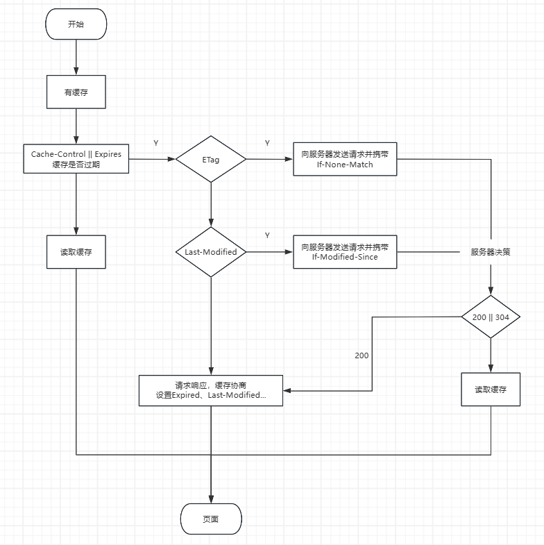

# 浏览器缓存

https://developer.mozilla.org/zh-CN/docs/Web/HTTP/Caching

浏览器缓存是一种存储在用户设备上的技术，用于存储网页、图片、脚本、样式表等资源，以便在后续访问时加快加载速度

::: info 缓存的作用

1. **提高加载速度**：通过缓存已下载的资源，后续访问可从本地加载
2. **节省带宽**：减少数据传输量，用户不需要每次访问网页时都重新下载相同的资源
3. **离线访问**：缓存允许用户在没有网络连接的情况下访问之前访问过的网页
4. **减少服务器负载**：减少服务器的请求次数，减轻服务器负担，提高网站的整体性能

:::


## 工作原理

浏览器缓存主要分为强缓存`(本地缓存)`和弱缓存`(协商缓存)`

::: info 缓存流程

1. **请求资源**：当用户访问一个网页时，浏览器会检查该资源是否已经被缓存
2. **检查缓存策略**：浏览器会根据资源的缓存策略（如`Cache-Control`头）来决定是否使用缓存。缓存策略可以指定资源的有效时间、是否允许缓存等
3. **使用缓存或重新下载**：如果资源仍然有效且允许缓存，浏览器会使用缓存中的资源。否则，浏览器会向服务器请求最新的资源，并将新资源存储在缓存中，以便下次使用
4. **更新缓存**：当服务器返回新的资源时，浏览器会更新缓存中的内容，以便下次访问时使用最新的资源

:::

 


## 本地缓存

以`HTTP Header `中的 `Expires、Cache-Control` 字段控制

**Cache-Control `HTTP1.1`**

| 值        | 描述                                             |
| --------- | ------------------------------------------------ |
| public    | 资源客户端和服务器都可以缓存                     |
| private   | 仅客户端可以缓存（默认）                         |
| max-age   | 过期时间，单位秒                                 |
| no-cache  | 协商缓存                                         |
| no-store  | 不启发式缓存（默认）、不强缓存、不协商缓存       |
| max-stale | 即使缓存过期，给定时间内（单位秒），也使用该缓存 |
| max-fresh | 期望给定时间内（单位秒），获取最新资源           |

```http
Cache-Control: public, max-age=86400
```

**Expires `HTTP1.0`**

资源缓存的过期时间，值为时间戳，它是根据本地时间进行判断，优先级低于 `Cache-Control`

```http
Expires: 86400
```


## 协商缓存

**Etage**

资源的唯一标识，优先级高于Last-Modified

```http
Etag: "336af4d1fafabcca3b770c8ad7a50781"
```


::: info if-None-Match

值为服务端返回的ETag值，再次请求时，服务端会重新生成Etag与其比较，一致则命中缓存，反之返回新资源并更新Etag

:::

**Last-Modified**

资源在服务器最后修改的时间

```http
last-modified: Tue, 12 Nov 2024 07:12:11 GMT
```

::: info if-Modified-Since

值为服务端返回的Last-Modified值，再次请求时，与服务端资源最后修改时间比较，一致则命中缓存，反之返回新资源并更新Last-Modified

:::

