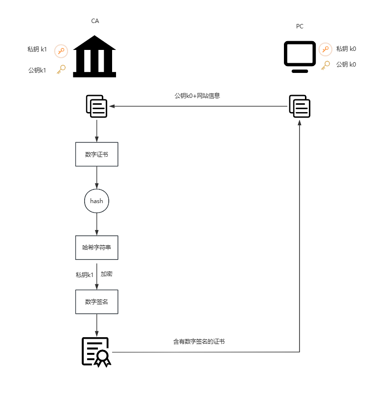

# 数字证书

HTTPS的工作原理

1. ‌**数据加密**‌：使用SSL/TLS协议对数据进行加密，防止数据被窃取或被第三方恶意篡改‌
2. ‌**证书验证**‌：要求网站必须拥有合法的SSL证书，由权威的证书颁发机构（CA）颁发，确保与网站建立的安全连接是受信任的‌
3. ‌**防止劫持**‌：通过加密技术防止数据在传输过程中被劫持‌
4. ‌**身份验证**‌：提供对网站的身份验证机制，防止用户被虚假网站欺骗‌

## 对称加密

对称加密，加密和解密过程使用相同的密钥。

优点：加密和解密速度快，适合处理大量数据

缺点：密钥管理复杂，且在非安全信道中密钥交换的安全性难以保障

密钥分发：物理方式传递、第三方分发、安全信道

常见：AES、DES、3DES、Blowfish、Twofish、RC4、Serpent、Camellia

  

## 非对称加密

非对称加密，加密和解密使用不同的密钥，公钥负责加密，私钥负责解密，必须成对出现。

优点：密钥分发简单，安全性较高，适合处理少量数据

缺点：加密算法复杂，计算复杂度较高，性能较低

常见：RSA、ECC、Diffie-Hellman、ElGamal

 

## 数字证书

中间人可以劫持公钥，生成自己的公钥私钥并将其公钥传给客户端，客户端使用其公钥加密，中间人可用对应的私钥解密，获取到明文，也可以对内容篡改，再使用劫持到的公钥加密。此种情况下，加密形同虚设。

 

究其原因是公钥的信任问题，无法保证公钥到底是网站的还是中间人的。由此需要使用第三方来解决此问题，第三方指的是证书颁发机构（Certificate Authority，简称CA）。

   

服务端获取CA颁发的证书，将其发送给客户端，当然中间人也可以获取到该证书。假设中间人伪造数字证书，哈希运算后得到的值就与数字签名解密后的值不一致。如若保持一致则需伪造数字签名，问题是CA私钥的破解几乎不可能。

  

## 证书链

CA机构同样存在公钥信任问题，由此引入了根CA，对中间CA数字证书签名。根CA是最顶层的，它是通过自签的方式对数字证书签名。根CA证书是用户的操作系统或浏览器已预先安装好的。

::: tip 

上层CA私钥给下层CA证书签名，上层CA公钥给下层的数字签名校验

:::

 

根CA可以直接给网站颁发证书，为什么还要中间CA？假设根CA私钥被破解，则所有证书将无法保证安全性，中间CA使得网站与根CA无直接关联，即使某个CA私钥被破解也不至于连根拨起。

 