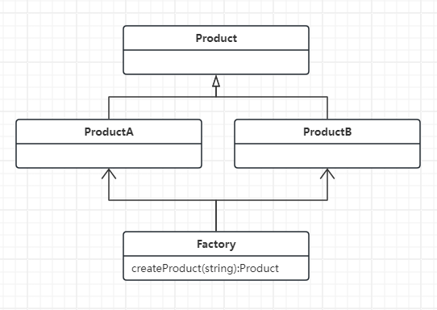
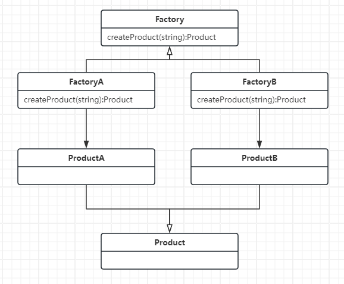
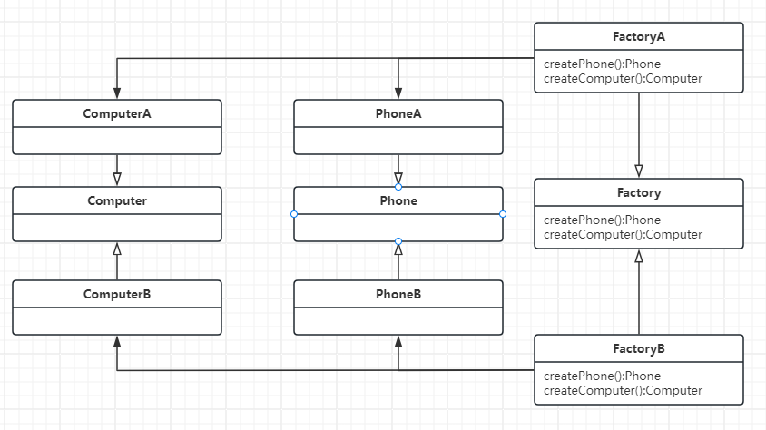

# 23种设计模式

## 创建型模式(6)

### 单例模式

确保一个类只有一个实例，能够自行实例化并向系统提供该实例

::: info 适用场景

- 严格控制全局变量
- 对于一个客户端只需要一个实例

 ::: 


::: danger  优缺点

- ✅保证类只有一个实例
- ✅仅在首次访问时初始化，节约资源
- ❎全局状态，可能导致难以调试和测试
- ❎隐藏依赖状态，多个部分可能依赖相同的单例实例
- ❎违反单一职责原则，一个类承担过多的指责

 :::

```ts
class Singleton {
  private static instance: Singleton

  private constructor() {}

  public static getInstance(): Singleton {
    if (!Singleton.instance) {
      Singleton.instance = new Singleton()
    }
    return Singleton.instance
  }
  
  public someBusinessLogic() {
    // do something
  }
}

const instance1 = Singleton.getInstance()
const instance2 = Singleton.getInstance()
console.log(instance1 === instance2) // true
```


### 原型模式

复制已有对象，无需使得代码依赖它们的所属类，需要类自己提供克隆方法

::: info 适用场景

需要复制对象且代码独立于对象的具体类，比如第三方接口传递的对象，代码不能够依赖这些对象的具体类，因为它们是不确定的

::::


::: danger 优缺点

- ✅可以克隆对象，无需关心具体类
- ✅可以克隆预先生成的原型，避免反复运行初始化代码
- ✅可以通过继承意外的方式处理对象的不同配置
- ❎克隆循环引用的复杂对象比较麻烦

:::

```ts
class ComponentReference {
  public prototype
  constructor(prototype: Prototype) {
    this.prototype = prototype
  }
}

class Prototype {
  public date: Date
  public name: string
  public component: ComponentReference

  constructor() {
    this.name = 'Prototype'
    this.date = new Date()
    this.component = new ComponentReference(this)
  }

  public clone(): Prototype {
    const clone = Object.create(this)
    return clone
  }
}

const prototype = new Prototype()
const clone = prototype.clone()

console.log(prototype === clone) // false
console.log(prototype.name === clone.name) // true
console.log(prototype.date === clone.date) // true
console.log(prototype.component === clone.component) // true
```


### 生成器模式

亦称建造者模式，使你能够分步骤创建复杂的对象。该模式允许你使用相同的创建代码生成不同类型和形式的对象。

::: info 适用场景

- 构造函数需要多个可选参数控制，调用复杂
- 创建各种形式的产品，它们的制造过程相似仅在细节有差异
- 可分步骤构造产品，某些步骤顺序并不影响最终产品

:::


::: danger 优缺点

- ✅可分步骤创建对象，暂缓创建步骤
- ✅生成不同形式的产品，可复用相同的制造代码
- ✅单一原则，产品生成代码抽取同一位置，易于维护
- ✅开闭原则，引入新产品变体时，无需修改客户端代码
- ❎需要新增建造类，若对象不复杂时使用反而会使代码更复杂

:::

```ts
class House {
  public wall?: string
  public door?: string
  public window?: string
}

class HouseBuilder {
  public house: House

  constructor() {
    this.house = new House()
  }

  reset() {
    this.house = new House()
  }

  setWindow(window: string) {
    this.house.window = window
    return this
  }

  setDoor(door: string) {
    this.house.door = door
    return this
  }

  setWall(wall: string) {
    this.house.wall = wall
    return this
  }

  build() {
    const house = this.house
    this.reset()
    return house
  }
}

const builder = new HouseBuilder()
const house = builder.setWall('wall').setDoor('door').build() 
```


### 简单工厂模式

可根据参数的不同返回不同的类实例，被创建的实例它们具有共同的父类

::: info 适用场景

- 创建对象少
- 不关系创建过程

:::


::: danger 优缺点

- ✅只需传入正确参数，即可获取相应对象，无需关心创建细节
- ❎增加新的产品，需要修改工厂逻辑，违反开闭原则

:::

   

```ts
class Product {}
class ProductA implements Product {}
class ProductB implements Product {}

class SimpleFactory {
  createProduct(type: string) {
    if (type === 'A') {
      return new ProductA()
    } else if (type === 'B') {
      return new ProductB()
    }
  }
}

const factory = new SimpleFactory()
const productA = factory.createProduct('A')
const productB = factory.createProduct('B')
```


### 工厂方法模式

（每个工厂一条生产线）亦称虚拟构造函数，定义一个创建对象的接口，让子类决定实例化那个类，使类的实例化延迟到子类

::: info 适用场景

- 无法预知对象确切类别及其依赖关系，将创建产品的代码与实际使用产品的代码分离，从而在不影响其他代码的情况下扩展创建产品的代码
- 扩展软件库或框架的内部组件，将各框架中构造组件的代码集中到单个工厂方法中，并在继承改组件之外允许任何人对该方法重写
- 复用现有对象节省系统资源，而不是每次都重新创建对象

:::

::: danger 优缺点

- ✅可避免创建者和具体产品直接的紧密耦合
- ✅单一职责原则，将产品创建代码放在单一位置，从而更容易维护
- ✅开闭原则，无需更改现有代码可引入新的产品类型
- ❎引入许多新的工厂类和产品类，代码可能会因此变得复杂

:::

 

```ts
interface Product {}
class ProductA implements Product {}
class ProductB implements Product {}


 abstract class Factory {
  public abstract createProduct(): Product
}

class FactoryA extends Factory {
  createProduct() {
    return new ProductA()
  }
}

class FactoryB extends Factory {
  createProduct() {
    return new ProductB()
  }
}
const factoryA = new FactoryA()
const factoryB = new FactoryB()
const productA = factoryA.createProduct()
const productB = factoryB.createProduct()
```


### 抽象工厂模式

（同一个工厂多条生产线）提供异种方式封装一系列相互关联或相互依赖的对象，无需指定具体类

:::  info 适用场景

代码需要与多个不同系列的相关产品交互，但是无法提前获取相关信息，或出于未来扩展性的考虑，不希望代码基于产品的具体类构建

:::

::: danger 优缺点

- ✅确保同一工厂生成的产品相互匹配
- ✅避免客户端代码和具体产品代码的耦合
- ✅单一原则，产品生成代码抽取同一位置，易于维护
- ❎引入新的工厂类和产品类，代码可能会更复杂
- ❎增加新的产品，需要修改工厂逻辑，违反开闭原则

:::

  

```ts
interface Phone {}
interface Computer {}

class PhoneA implements Phone {}
class PhoneB implements Phone {}
class ComputerA implements Computer {}
class ComputerB implements Computer {}

interface Factory {
  createPhone(): Phone
  createComputer(): Computer
}

class FactoryA implements Factory {
  createPhone(): Phone {
    return new PhoneA()
  }
  createComputer(): Computer {
    return new ComputerA()
  }
}

class FactoryB implements Factory {
  createPhone(): Phone {
    return new PhoneB()
  }
  createComputer(): Computer {
    return new ComputerB()
  }
}

const factoryA = new FactoryA()
const phoneA = factoryA.createPhone()
const computerA = factoryA.createComputer()
const factoryB = new FactoryB()
const phoneB = factoryB.createPhone()
const computerB = factoryB.createComputer()
```


 

## 结构型模式(7)

### 适配器模式

它能够使接口不兼容的对象相互合作

::: info 适用场景

- 希望使用某个类，但是其接口与其他代码不兼容
- 多个类同处一个继承体系，此时需要扩展功能，可以通过扩展每个子类实现，但是所有子类重复添加不优雅，可将扩展的功能封装到适配中

:::


::: danger 优缺点

- ✅开闭原则，无需修改客户端代码可添加新类型适配器
- ✅单一原则，将转换代码从业务逻辑中分离
- ❎增加一系列接口和类，代码可能更复杂

:::

```ts
class Target {
  request() {
    return 'default request'
  }
}

class Adaptee {
  specificRequest() {
    return 'Adaptee specificRequest'
  }
}

class Adapter extends Target {
  private adaptee: Adaptee

  constructor(adaptee: Adaptee) {
    super()
    this.adaptee = adaptee
  }

  request() {
    const result = this.adaptee.specificRequest()
    return `Adapter translate ${result}`
  }
}

const target = new Target()
target.request()
const adaptee = new Adaptee()
const adapter = new Adapter(adaptee)
adapter.request()
```


### 桥接模式

将抽象和实现解耦，使得两者能够独立变化，抽象部分关联实现部分进行多种组合

::: info 适用场景

能够拆分为多个独立的维度，它们之间可以相互组合

::: 

::: danger 优缺点

- ✅客户端仅与抽象部分互动
- ✅开闭原则，新增抽象部分和实现部分，不会相互影响
- ✅单一原则，抽象部分处理高层逻辑，实现部分处理平台细节
- ❎高内聚的类使用该模式可能会使得代码更加复杂

:::

```ts
// 抽象部分
class Abstraction {
  protected implementor: Implementor

  constructor(implementor: Implementor) {
    this.implementor = implementor
  }

  public request() {
    this.implementor.operationImpl()
  }
}

// 扩展抽象部分而无需修改实现部分
class RefinedAbstraction extends Abstraction {
  constructor(implementor: Implementor) {
    super(implementor)
  }

  public operation() {
    console.log('扩展抽象部分')
    this.implementor.operationImpl()
  }
}

// 实现部分
interface Implementor {
  operationImpl(): void
}

class ConcreteImplementorA implements Implementor {
  public operationImpl() {
    console.log('具体实现A')
  }
}

class ConcreteImplementorB implements Implementor {
  public operationImpl() {
    console.log('具体实现B')
  }
}

// 客户端
function clientCode(abstraction: Abstraction) {
  abstraction.request()
}

const implementorA = new ConcreteImplementorA()
const abstractionA = new Abstraction(implementorA)
clientCode(abstractionA)

const implementorB = new ConcreteImplementorB()
const abstractionB = new RefinedAbstraction(implementorB)
clientCode(abstractionB)
```


### 组合模式

可以使用它将对象组合成树状结构，并且能够像使用独立对象一样使用它们(组合体)

::: info 适用场景

- 需要实现树状对象结构：简单叶节点和复杂容器，容器包含叶节点和其他容器
- 希望客户端使用相同方式处理简单和复杂元素，所有元素(叶节点、容器)共用同一个接口，它们功能基本是一致的

:::

::: danger 优缺点

- ✅可利用多态和递归机制方便使用复杂树结构
- ✅开闭原则，无需修改代码，可添加新元素成为树的一部分
- ❎对于功能差异较大的类，提供公共接口可能会复杂

:::

```ts
// 公共接口
interface Counter {
  count(): number
}

// 叶节点
class City implements Counter {
  private sum: number = 0

  constructor(sum: number) {
    this.sum = sum
  }

  count() {
    return this.sum
  }
}

// 容器
class Composite implements Counter {
  private sum: number = 0
  private children: Counter[] = []

  add(counter: Counter) {
    this.children.push(counter)
  }

  count() {
    this.sum = this.children.reduce((prev, curr) => prev + curr.count(), 0)
    return this.sum
  }
}


const china = new Composite()
china.add(new City(1000))
china.add(new City(2000))

const shanghai= new Composite()
shanghai.add(new City(3000))
shanghai.add(new City(4000))

china.add(shanghai)
console.log(china.count())
```


### 装饰器模式

允许你通过将对象放入特殊的封装对象中来为原有对象运行时动态添加额外的功能。就增加功能来说，装饰器模式比生成子类(继承)更加灵活。

::: info 适用场景

- 希望无需修改代码情况下使用对象且能够在运行时为对象新增额外的行为
- 用继承扩展对象行为的方案难以实现或根本不可行时

:::

::: danger 优缺点

- ✅动态为对象添加新行为，无需修改原有代码
- ✅开闭原则，无需修改代码，可添加装饰器扩展
- ✅单一原则，将多个行为大类拆分为多个小类
- ❎实现行为不受装饰栈顺序影响的装饰比较困难

:::

```ts
interface Component {
  operation(): string
}
class ConcreteComponent implements Component {
  public operation() {
   return 'ConcreteComponent operation'
  }
}

// 装饰器基类
class BaseDecorator implements Component {
  protected component: Component

  constructor(component: Component) {
    this.component = component
  }

  public operation() {
    return this.component.operation()
  }
}

// 具体装饰器
class ConcreteDecorator extends BaseDecorator{
  public operation() {
   return `ConcreteDecorator ${super.operation()}`
  }
}

const component = new ConcreteComponent()
const decorator = new ConcreteDecorator(component)
decorator.operation()
```


### 外观模式

为程序库、框架、复杂类提供一个简单的接口

::: info 适用场景

- 复杂的子系统，但只需要使用其中部分功能
- 将子系统组织为多层结构，通过外观定义各层次入口，减少子系统之间耦合

:::

::: danger 优缺点

- ✅使自己的代码独立于复杂的系统
- ❎违反开闭原则，新增子系统需要修改外观类

:::

```ts
class Facade {
  private subSystem1: SubSystem1
  private subSystem2: SubSystem2
  private subSystem3: SubSystem3

  constructor() {
    this.subSystem1 = new SubSystem1()
    this.subSystem2 = new SubSystem2()
    this.subSystem3 = new SubSystem3()
  }

  public operation(): void {
    this.subSystem1.method1()
    this.subSystem2.method2()
    this.subSystem3.method3()
  }
}

class SubSystem1 {
  public method1(): void {
    console.log('子系统1的方法1被调用')
  }
}

class SubSystem2 {
  public method2(): void {
    console.log('子系统2的方法2被调用')
  }
}

class SubSystem3 {
  public method3(): void {
    console.log('子系统3的方法3被调用')
  }
}

const facade = new Facade()
facade.operation()
```


### 享元模式

运用共享技术，通过共享多个对象的共有状态，在有限内存中载入更多对象

::: tip 相关概念

- 情景：原始对象中各不相同的外在状态。
- 内在状态：包含不变的在多个对象中重复使用的成员变量，这些变量需设置为不可修改的，仅在构造函数中获得初始值
- 外在状态：包含每个对象各自不同情景数据的成员变量，须有客户端传入相关参数

:::


::: info 适用场景

仅在程序必须支持大量相似对象且没有足够的内存容量时

:::

::: danger 优缺点

- ✅大量相似对象，可节省内存
- ❎内外状态分离，可能使得代码更加复杂

:::

```ts
class Flyweight {
  // 内部状态
  private name: string

  constructor(name: string) {
    this.name = name
  }

  // 外部状态
  public draw(x: number, y: number) {
    console.log(`绘制对象(${this.name})`)
    console.log(`绘制坐标(${x},${y})`)
  }

  public getState() {
    return this.name
  }
}

class FlyweightFactory {
  private flyweights: Flyweight[] = []

  public getFlyweight(name: string) {
    let flyweight = this.flyweights.find((f) => f.getState() === name)
    if (!flyweight) {
      flyweight = new Flyweight(name)
      this.flyweights.push(flyweight)
    }
    return flyweight
  }
}

const factory = new FlyweightFactory()
const flyweight1 = factory.getFlyweight('tree')
const flyweight2 = factory.getFlyweight('bird')
const flyweight3 = factory.getFlyweight('tree')

flyweight1.draw(1, 2)
flyweight2.draw(3, 4)
console.log(flyweight1 === flyweight3) // true
```


### 代理模式

为目标对象提供一种代理以控制对这个对象的访问

::: info 适用场景

- 对于重量级服务对象可延迟初始化，仅在对象需要使用时再初始化
- 访问控制，希望特定客户端才能够访问服务对象
- 远程代理，代理通过网络传递客户端请求
- 日志记录代理，可在向服务传递请求前记录
- 缓存代理，对重复请求获取的相同结果进行缓存
- 智能引用，检查是否有客户端正在使用，若为空可销毁服务对象，释放资源

:::

::: danger 优缺点

- ✅可在客户端毫无察觉情况下控制服务对象
- ✅即使服务对象未准备或不存在，也可正常工作
- ✅开闭原则，可在不修改服务和客户端情况下创建新的代理
- ❎服务响应延迟
- ❎需要新增类，可能使得代码更加复杂

:::

```ts
interface Subject {
  request(): void
}

class RealSubject implements Subject {
  request(): void {
    console.log('RealSubject: Handling request.')
  }
}

class Proxy implements Subject {
  private realSubject: RealSubject

  constructor() {
    this.realSubject = new RealSubject()
  }

  request(): void {
    if (this.checkAccess()) {
      this.realSubject.request()
      this.logAccess()
    }
  }

  private checkAccess(): boolean {
    console.log('Proxy: Checking access prior to firing a real request.')
    return true
  }

  private logAccess(): void {
    console.log('Proxy: Logging the time of request.')
  }
}


const proxy = new Proxy()
proxy.request()
```


## 行为模式(10)

### 责任链模式

允许将请求沿着处理链进行发送。收到请求后，每个处理者均可对请求作出处理，或将其传递给链上的下个处理者

::: info 适用场景

- 需要使用不同方式处理不同种类的请求，而且请求类型和顺序未知时
- 必须按顺序执行多个处理者时
- 所需处理这及其顺序必须在运行时改变

:::

::: danger 优缺点

- ✅控制请求的处理顺序
- ✅单一原则，请求和操作解耦
- ✅开闭原则，可在不修改服务和客户端情况下创建新的处理者
- ❎部分请求可能未被处理
- ❎可能影响系统执行效率

:::

```ts
interface Handler<Request, Result> {
  handle(request: Request): Result | null
  setNext(handler: Handler<Request, Result>): Handler<Request, Result>
}

abstract class AbstractHandler<Request, Result> implements Handler<Request, Result> {
  private nextHandler: Handler<Request, Result> | null = null

  setNext(handler: Handler<Request, Result>): Handler<Request, Result> {
    this.nextHandler = handler
    return handler
  }

  public handle(request: Request) {
    if (this.nextHandler) {
      return this.nextHandler.handle(request)
    }

    return null
  }
}

class ConcreteHandler1<Request, Result> extends AbstractHandler<Request, Result> {
  public handle(request: Request): Result | null {
    console.log('ConcreteHandler1 handle request')
    return super.handle(request)
  }

}

class ConcreteHandler2<Request, Result> extends AbstractHandler<Request, Result> {
  public handle(request: Request): Result | null {
    console.log('ConcreteHandler2 handle request')
    return super.handle(request)
  }
}


const handler1 = new ConcreteHandler1<string,string>()
const handler2 = new ConcreteHandler2<string,string>()

handler1.setNext(handler2)
handler1.handle('request')
```


### 命令模式

可将请求转换为一个包含与请求相关的所有信息的独立对象。该转换能让你根据不同请求将方法参数化，延迟请求执行或将其放入队列中，且能够实现撤销操作

::: info 适用场景

- 实现操作回滚
- 将操作放入队列中
- 通过操作参数化对象，将对象作为参数，执行不同操作

:::

::: danger 优缺点

- ✅可实现操纵延迟
- ✅可实现撤销和恢复
- ✅可将简单命令组合复杂命令
- ✅单一原则，触发和执行解耦
- ✅开闭原则，可在不修改服务和客户端情况下创建新命令
- ❎发送者与接受者之间添加新层次可能会使代码复杂

:::

```ts
interface Command {
  execute(): void
}

class SimpleCommand implements Command {
  private payload: string

  constructor(payload: string) {
    this.payload = payload
  }

  execute(): void {
    console.log(`SimpleCommand: See, I can do simple things like printing (${this.payload})`)
  }
}

class ComplexCommand implements Command {
  private receiver: Receiver
  private a: string
  private b: string

  constructor(receiver: Receiver, a: string, b: string) {
    this.receiver = receiver
    this.a = a
    this.b = b
  }

  execute(): void {
    console.log('ComplexCommand: Complex stuff should be done by a receiver object.')
    this.receiver.doSomething(this.a)
    this.receiver.doSomethingElse(this.b)
  }
}

// 接收者
class Receiver {
  public doSomething(a: string): void {
    console.log(`Receiver: Working on (${a})`)
  }

  public doSomethingElse(b: string): void {
    console.log(`Receiver: Also working on (${b})`)
  }
}

// 发送者
class Invoker {
  private onStart: Command
  private onFinish: Command

  public setOnStart(command: Command): void {
    this.onStart = command
  }

  public setOnFinish(command: Command): void {
    this.onFinish = command
  }

  public start(): void {
    console.log('Invoker: Invoking Sample Command Start')
    if (this.onStart) {
      this.onStart.execute()
    }
  }

  public finish(): void {
    console.log('Invoker: Invoking Sample Command Finish')
    if (this.onFinish) {
      this.onFinish.execute()
    }
  }
}

const invoker = new Invoker()
const receiver = new Receiver()
const startCommand = new SimpleCommand('Say Hi!')
const endCommand = new ComplexCommand(receiver, 'Send email', 'Save report')
invoker.setOnStart(startCommand)
invoker.setOnFinish(endCommand)
invoker.start()
invoker.finish()
```


### 迭代器模式

让你能够在不暴露集合底层表现形式（列表、栈、树等）的情况下遍历集合中的所有元素

::: info 适用场景

- 希望遍历不同的甚至是无法预知的数据结构，前提是它们都需要实现提供的通用接口
- 希望对客户端隐藏其复杂性，为客户端提供多个访问集合元素的简单方法

:::

::: danger 优缺点

- ✅可暂定遍历并在需要时继续
- ✅可并行遍历同一集合，因为每个迭代器对象都包含自身遍历状态
- ✅开闭原则，可实现新的集合和迭代器传递给现有代码而无需修改
- ❎对于某些特殊集合，使用迭代器可能比直接遍历效率低

:::

```ts
interface Iterator<T> {
  current(): T
  next(): T
  key(): number
  valid(): boolean
  rewind(): void
}

interface Aggregate<T> {
  getCount(): number
  getItems(): T[]
  addItem(item: T): void
  getIterator(reverse?: boolean): Iterator<T>
}

// 迭代器
class ConcreteIterator implements Iterator<string> {
  private collection: WordsCollection
  private position: number = 0
  private reverse: boolean = false

  constructor(collection: WordsCollection, reverse = false) {
    this.collection = collection
    this.reverse = reverse

    if (reverse) {
      this.position = collection.getCount() - 1
    }
  }

  current(): string {
    return this.collection.getItems()[this.position]
  }

  next(): string {
    const item = this.collection.getItems()[this.position]
    this.position += this.reverse ? -1 : 1
    return item
  }

  key(): number {
    return this.position
  }

  valid(): boolean {
    if (this.reverse) {
      return this.position >= 0
    } else {
      return this.position < this.collection.getCount()
    }
  }

  rewind(): void {
    this.position = this.reverse ? this.collection.getCount() - 1 : 0
  }
}

// 底层集合
class WordsCollection implements Aggregate<string> {
  private items: string[] = []

  addItem(item: string) {
    this.items.push(item)
  }

  getCount(): number {
    return this.items.length
  }

  getItems(): string[] {
    return this.items
  }

  getIterator(reverse: boolean = false): Iterator<string> {
    return new ConcreteIterator(this, reverse)
  }
}

const collection = new WordsCollection()
collection.addItem('First')
collection.addItem('Second')
collection.addItem('Third')

const iterator = collection.getIterator()
while (iterator.valid()) {
  console.log(iterator.next())
}

const reverseIterator = collection.getIterator(true)
while (reverseIterator.valid()) {
  console.log(reverseIterator.next())
}
```


### 中介者模式

减少对象之间混乱无序的依赖关系。它会限制对象之间的直接交互，迫使它们通过一个中介者对象进行合作

::: info 适用场景

- 当一些对象与其他对象紧密耦合以致于难以修改时
- 当组件过于依赖其他组件而无法在不同应用中复用时
- 为了能在不同场景复用一些基本行为，导致需要被迫创建大量组件子类时

:::

::: danger 优缺点

- ✅减轻多个组件间的耦合关系
- ✅单一原则，将多个组件交流抽取到同一位置
- ✅开闭原则，无需修改代码可添加新的中介
- ❎中介者可能会不断复杂

:::

```ts
interface Mediator {
  notify(sender: Component, message: string): void;
}

class ConcreteMediator implements Mediator {
  private components: Component[] = [];

  add(component: Component) {
    this.components.push(component);
  }

  notify(sender: Component, message: string) {
    for (const component of this.components) {
      if (component !== sender) {
        component.receive(message);
      }
    }
  }
}

class Component {
  private mediator: Mediator;

  constructor(mediator: Mediator) {
    this.mediator = mediator;
  }

  send(message: string) {
    this.mediator.notify(this, message);
  }

  receive(message: string) {
    console.log(`Received message: ${message}`);
  }
}


const mediator = new ConcreteMediator();
const component1 = new Component(mediator);
const component2 = new Component(mediator);

mediator.add(component1);
mediator.add(component2);

component1.send("Hello, component2!");
component2.send("Hi, component1!");
```


### 备忘录模式

允许在不暴露对象实现细节的情况下保持和恢复对象之前的状态

::: info 适用场景

- 需要将创建对象快照恢复其之前状态时
- 直接访问对象成员变量，会导致封装被突破时

:::

::: danger 优缺点

- ✅不破坏对象封装的前提下创建对象快照
- ✅可通过备忘录栈（负责人）维护对象历史状态
- ❎客户端频繁创建备忘录，消耗资源
- ❎负责人必须完整跟踪对象的声明周期，才能销毁弃用的备忘录
- ❎部分动态变成语言（php\pythone\javascript）无法保证备忘录状态不被修改

:::

```ts
interface Originator {
  save(): Memento
}

interface Memento {
  restore(): void
}

// 备忘内容
type BackUpContent = {
  [key: string]: any
}

// 原发器(需要备忘的对象)
class ConcreteOriginator implements Originator {
  private content: BackUpContent = {}

  public save() {
    return new ConcreteMemento(this, this.content)
  }

  public setContent(content: BackUpContent) {
    this.content = content
  }

  public printContent() {
    console.log(this.content)
  }
}

// 备忘录
class ConcreteMemento implements Memento {
  private content: BackUpContent = {}
  private originator: ConcreteOriginator

  constructor(originator: ConcreteOriginator, content: BackUpContent) {
    this.content = content
    this.originator = originator
  }

  public restore() {
    this.originator.setContent(this.content)
  }
}

// 负责人(历史记录)
class Caretaker {
  private history = new Array<ConcreteMemento>()

  public add(memento: ConcreteMemento) {
    this.history.push(memento)
  }

  public undo() {
    if (this.history.length > 0) {
      const memento = this.history.pop()
      memento && memento.restore()
    }
  }
}

const caretaker = new Caretaker()
const originator = new ConcreteOriginator()

originator.setContent({ a: 1 })
caretaker.add(originator.save())
originator.setContent({ b: 2 })
caretaker.add(originator.save())
originator.setContent({ c: 3 })
caretaker.add(originator.save())
originator.setContent({ d: 4 })

originator.printContent() // {d"4}
caretaker.undo()
caretaker.undo()
originator.printContent() // {b:2}
```


### 发布订阅模式

允许你定义一种订阅机制，可在对象变化时通知多个观察该对象的其他对象

::: info 适用场景

当一个对象的改变需要改变其他对象，或实际对象是事先未知的或动态变化的

:::

::: danger 优缺点

- ✅开闭原则，无需修改代码可引入新的订阅者/发布者
- ✅可在运行时建立对象之间的联系
- ❎订阅者通知顺序是随机的

:::

```ts
interface Subscriber {
  update(): void
}

class Subscriber1 implements Subscriber {
  update() {
    console.log('Subscriber1 update')
  }
}

class Subscriber2 implements Subscriber {
  update() {
    console.log('Subscriber2 update')
  }
}

interface Publisher {
  subscribe(subscriber: Subscriber): void
  unsubscribe(subscriber: Subscriber): void
  notify(): void
}

class PublisherManager implements Publisher {
  subscribers: Subscriber[] = []

  subscribe(subscriber: Subscriber) {
    this.subscribers.push(subscriber)
  }

  unsubscribe(subscriber: Subscriber) {
    this.subscribers = this.subscribers.filter((item) => item !== subscriber)
  }

  notify() {
    this.subscribers.forEach((item) => item.update())
  }
}

const publisher = new PublisherManager()
const subscriber1 = new Subscriber1()
const subscriber2 = new Subscriber2()

publisher.subscribe(subscriber1)
publisher.subscribe(subscriber2)
publisher.notify()
publisher.unsubscribe(subscriber1)
publisher.notify()
```


### 状态模式

能在一个对象的内部状态改变时改变其行为，使其看上去就像改变自身所属类一样

::: info 适用场景

- 对象需要根据自身状态改变不同的行为时
- 某个类需要根据成员变量的值改变自身行为时，从而需要大量条件语句时

:::

::: danger 优缺点

- ✅开闭原则，无需修改代码可新增新状态
- ✅单一原则，状态相关代码存在单独类
- ❎状态机只有几个状态时，使用反而会复杂

:::

```ts
// 状态对上下文有一定的依赖
// 特定状态知道其他状态的存在，且能够从一个状态转换到另一个状态
abstract class State {
  //@ts-ignore
  protected context: Context

  public setContext(context: Context) {
    this.context = context
  }

  public abstract handle1(): void
  public abstract handle2(): void
}

class ConcreteStateA extends State {
  handle1() {
    console.log('ConcreteStateA handles request1')
    console.log('ConcreteStateA wants to change state of then context')
    this.context.setState(new ConcreteStateB())
  }

  handle2() {
    console.log('ConcreteStateA handles request2')
  }
}

class ConcreteStateB extends State {
  handle1() {
    console.log('ConcreteStateB handles request1')
  }

  handle2() {
    console.log('ConcreteStateB handles request2')
    console.log('ConcreteStateB wants to change state of then context')
    this.context.setState(new ConcreteStateA())
  }
}

class Context {
  //@ts-ignore
  private state: State

  constructor(state: State) {
    this.setState(state)
  }

  public setState(state: State) {
    this.state = state
    this.state.setContext(this)
  }

  public request1() {
    this.state.handle1()
  }

  public request2() {
    this.state.handle2()
  }
}

const context = new Context(new ConcreteStateA())
context.request1()
context.request2()
```


### 策略模式

它能让你定义一系列算法，并将每种算法放入独立的类中，以使得算法对象能够相互替换

::: info 适用场景

- 希望使用对象各种不同算法变体，并希望能够在运行时切换算法
- 算法在上下文逻辑中不是很重要时，该模式可将算法与业务逻辑区分开来

:::

::: danger 优缺点

- ✅可在运行时切换算法
- ✅可将实现与使用区分
- ✅可使用组合代替继承
- ✅开闭原则，可直接新增策略
- ❎客户端需要知晓策略间的不同，以此选择合适的策略

:::

```ts
// 策略完全不依赖上下文
// 策略之间不知道对方的存在
interface Strategy {
  handle(): void
}

class ConcreteStrategy1 implements Strategy {
  public handle() {
    console.log('策略1')
  }
}

class ConcreteStrategy2 implements Strategy {
  public handle() {
    console.log('策略2')
  }
}

class Context {
  private strategy: Strategy

  constructor(strategy: Strategy) {
    this.strategy = strategy
  }

  public setStrategy(strategy: Strategy) {
    this.strategy = strategy
  }

  public handle() {
    this.strategy.handle()
  }
}

const context = new Context(new ConcreteStrategy1())
context.handle() // 策略1
context.setStrategy(new ConcreteStrategy2())
context.handle() // 策略2
```


### 模板方法模式

在超类中定义一个算法框架，允许子类在不修改结构的情况下重写算法特定步骤

::: info 适用场景

希望扩展某个特定算法步骤，而不是整个算法或结构时

:::

::: danger 优缺点

- ✅可将重复代码提取到超类中
- ❎模板方法越多，维护越困难

:::

```ts
abstract class AbstractClass {
  templateMethod() {
    console.log('模板方法开始')
    this.step1()
    this.step2()
    console.log('模板方法结束')
  }

  abstract step1(): void
  abstract step2(): void
}

class ConcreteClass extends AbstractClass {
  step1() {
    console.log('步骤1')
  }

  step2() {
    console.log('步骤2')
  }
}

const concreteClass = new ConcreteClass()
concreteClass.templateMethod()
```


### 访问者模式

用于封装一些作用于某个数据结构中各元素的操作，它可以在不改变数据结构的前提下定义作用于这些元素新的操作

::: info 适用场景

- 需要对复杂对象结构中的所有元素执行某些操作时
- 某个行为仅在类层次结构中的一些类有意义时

:::

::: danger 优缺点

- ✅开闭原则，无需修改类可引入不同类对象上执行的新行为
- ✅单一原则，数据结构只需要执行元素的操作即可
- ❎访问者访问某个元素时，可能没有访问元素私有成员变量和方法的必要权限
- ❎每次在元素层新增或移除一个类时，都需要更新所有访问者


```ts
// 被访问者中的元素：必须提供一个accept方法，接受访问者
abstract class Hardware {
  command: string

  constructor(command: string) {
    this.command = command
  }

  public run() {
    console.log(this.command)
  }

  abstract accept(visitor: Visitor): void
}

class CPU extends Hardware {
  constructor(command: string) {
    super(command)
  }

  accept(visitor: Visitor) {
    visitor.visitCPU(this)
  }
}

class Disk extends Hardware {
  constructor(command: string) {
    super(command)
  }

  accept(visitor: Visitor) {
    visitor.visitDisk(this)
  }
}

// 访问者接口：每新增一个元素，接口就要添加一个方法
interface Visitor {
  visitCPU(cpu: Disk): void
  visitDisk(disk: Disk): void
}

class updateVisitor implements Visitor {
  visitCPU(cpu: CPU) {
    cpu.command = 'update cpu command'
  }

  visitDisk(disk: Disk) {
    disk.command = 'update disk command'
  }
}

// 数据结构
class Robot {
  private cpu: CPU
  private disk: Disk

  constructor() {
    this.cpu = new CPU('old cpu command')
    this.disk = new Disk('old disk command')
  }

  public accept(visitor: Visitor){
    this.cpu.accept(visitor)
    this.disk.accept(visitor)
  }

  public run() {
    this.cpu.run()
    this.disk.run()
  }
}


const robot = new Robot()
robot.run()
const visitor = new updateVisitor()
robot.accept(visitor)
robot.run()
```

