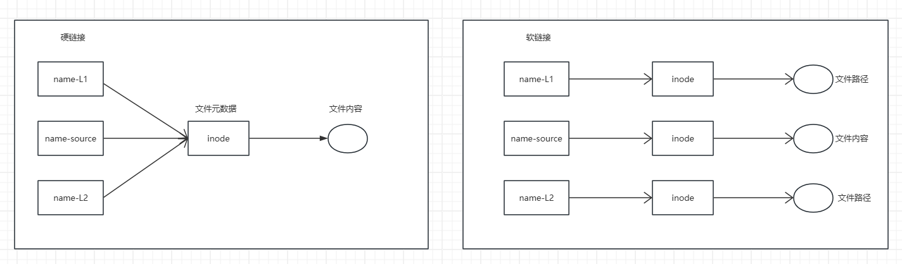

# 软硬链接

软硬连接得目的是为了实现文件得共享、备份和防误删

## 图解

 

::: tip

文件组成：文件元数据、文件内容

`inode`: 文件唯一标识；` inode[count]`：引用计数，默认为`1`；`inode[addr]`：物理地址

- 硬链接会导致引用计数的变化，值为`0`表示源文件及其副本均已删除

- 软链接会创建独立的` inode`，它所指向的磁盘地址存储的是目标文件路径

- 硬链接创建需要源文件必须存在，而软连接创建不强求

- 软连接工作原理：根据存储的目标路径信息，打开文件内容

:::

## 硬链接

::: info 特点

- 本身不占用磁盘空间
- 链接与源文件的权限一致
- 它们互为镜像副本，所有的改动都会同步
- 删除源文件并不影响硬链接，仅在源文件及其所有硬链接删除，才将其从磁盘删除
- 链接只能指向文件，若指向目录，那么目录下的文件/子目录更新时，硬链接都需要改变，情况复杂
- 链接不可跨文件系统，不可跨分区（磁盘分区），不同磁盘/分区可能存在不同文件系统，不同文件系统 inode 分配可能不同

:::

:::  danger 使用场景 

- 当需要为同一个文件创建多个别名时
- 当需要保护重要文件免受意外删除时
- 当许哟啊提高频繁访问文件的效率时

:::


## 软连接（符号链接）

::: info 特点

- 本身占很小的磁盘空间
- 链接与权限不完全一致
- 链接可以指向文件或目录
- 链接可以跨文件系统
- 删除、重命名、移动源文件，软连接会被挂起，再次创建源文件才生效，不需要时需将其删除

:::


::: danger 使用场景

- 当需要创建动态的文件后目录关联时
- 当需要保留源文件的属性和变化时
- 当需要不同位置或不同文件系统的文件/目录创建快捷方式时

:::

## 链接对比

```bash
mklink [/D,/J,/H] destination source 
dir # 可查看当前路径下存在的链接关系
```


|                    | 无参          | /D             | /J             | /H             |
| ------------------ | ------------- | -------------- | -------------- | -------------- |
| zh                 | 符号链接      | 符号链接       | 联接           | 硬链接         |
| en                 | Symbolic Link | Symbolic Link  | Junction       | Hard LInk      |
| 作用对象           | 文件          | 目录           | 目录           | 文件           |
| 资源管理器图标     | 快捷方式      | 文件夹快捷方式 | 文件夹快捷方式 | 无特殊显示     |
| 修改同步           | 是            | 是             | 是             | 是             |
| 删除同步           | 否            | 否             | 否             | 否             |
| 彻底删除           | 删除源        | 删除源         | 删除源         | 删除所有硬链接 |
| 移动源文件可访问   | 否            | 否             | 否             | 是             |
| 移动链接文件可访问 | 是            | 是             | 是             | 是             |
| 更名源文件可访问   | 否            | 否             | 否             | 是             |
| 更名链接文件可访问 | 是            | 是             | 是             | 是             |

> /J 必须是本机目录，/D 可以是网络资源


