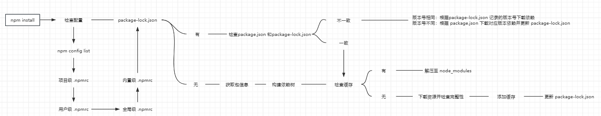

# NPM

https://www.npmjs.com/

## 基本字段

官方字段

```json
{
  "private": true, // 默认是公开的，设置true可防止无意间发包
  "name": "expample-package", // 包名
  "description": 'description-package', // 包描述
  "keywords": []， // 搜索关键词
  "license": { // 协议
  	"type": "repository",
  	"url": "https://example.com/license"
	}, 
  "versinon": "1.0.0", // 版本
  "author": "authore-name", // 作者
  "main": "index.ts" // 入口文件
  "script": {}, // 脚本命令 
  "config": {}, // 配置脚本环境变量
  "bin": {}, // 自定义命令
  "dependencies": {} // 生产时依赖
  "devDependencies": {}, // 开发时依赖
  "peerDependencies": {}, // 对等依赖-一般用于开发插件
	"overrides": {}, // 版本覆盖
	"homepage": "https://example.com/index", // 项目首页地址
	"bugs": { // 讨论社区地址，只填写url时可不使用对象
    "url": "https://example./issues",
    "email": "project@hostname.com"
  }
	"funding": { // 资助平台，多个可使用数组
    "type": "individual"
    "url": "https://example.com/fund"
  },
	"files": [], // 推送到npm的文件，接受正则、目录、文件
	"browser": { // 支持的浏览器版本，每个键对应一个版本
    "chrome": true
  }, 
	"repository": { // 指定代码存放的位置，可以是一个地址
    "type": "git",
    "url": "https://github.com/example.git",
    "directory": "package/example", // 项目不是直接在根目录下时需要指定路径
  },
	"os": ["win32","!linux"], // 适用操作系统，！表示不适用
	"cpu": ["x64","!arm"], // 适用的cpu架构
	"engines": { // 指定适用的node、npm版本
    "node": ">=16",
    "npm": ">=7"
  }，
	"publishConfig": {}, // 发包的配置
	"workspace": [], // 工作空间-含有效package.json的目录
}
```

非官方字段

```json
{
  "type": "module", //指定包的模块类型 默认commjs
  "browserslist": [ //支持的浏览器和版本
    "> 0.5%", 
    "last 2 versions",
    "Chrome",
  ],
  "typings": "types/index.d.ts", // ts 类型入口
  "lint-staged": {},   // git提交规范配置 
}
```


## 基本命令

```bash
npm init # 初始化package.json --yes看=可跳过问答
npm ci # 一次性安装所有依赖，无法d，必须存在package-lock.json
npm install package-name # 默认安装最新稳定版(lastest)
npm uninstall package-name # 卸载包，-g 卸载全局包
npm update package-name # 更新包，-g 更新全局包
npm info package-name # 最新包信息
npm view packge-name # 别名v，最新包信息
npm view package-name versions # 包所有版本
npm run # 查看package.json 设置的脚本
npm dedupe/ddp # 删除重复依赖，并在依赖间共享公共依赖，扁平化依赖
npm home package-name # 浏览器自动打开包的首页
npm repo package-name # 浏览器自动打开代码仓库地址
npm config list # 配置列表，参数 -l 可查看所有默认配置
npm config set [key] [value] # 设置/更新配置项
npm config unset key # 删除配置项
npm config cache path # 默认缓存位置C:\Users\Admin\AppData\Roaming\npm-cache
npm ls -g # 查看全局可执行命令
```

```bash
npm install package-name --save  # -S
npm install package-name --save-dev # -D
npm install --production # 仅安装dependencies字段
```

修改下载镜像源，默认下载地址在国外

```bash
npm install nrm -g # 全局安装，nrm：镜像源管理
nrm ls # 查看下载地址
nrm use taobao # 切换地址
npm install .. # 此时使用的是taobao镜像
```

统一包管理工具

corepack：https://github.com/nodejs/corepack

only-allow：https://github.com/pnpm/only-allow


## 配置文件

- 项目级 `[project-name]/.npmrc`
- 用户级 `C:\Users\Admin\.npmrc`
- 全局级 `C:\AppData\npm\.npmrc`
- 内置级 `[node-version]/node_modules/npm/.npmrc`

```bash
registry=http://registry.npmjs.org/
# 定义npm的registry，即npm的包下载源

proxy=http://proxy.example.com:8080/
# 定义npm的代理服务器，用于访问网络

https-proxy=http://proxy.example.com:8080/
# 定义npm的https代理服务器，用于访问网络

strict-ssl=true
# 是否在SSL证书验证错误时退出

cafile=/path/to/cafile.pem
# 定义自定义CA证书文件的路径

user-agent=npm/{npm-version} node/{node-version} {platform}
# 自定义请求头中的User-Agent

save=true
# 安装包时是否自动保存到package.json的dependencies中

save-dev=true
# 安装包时是否自动保存到package.json的devDependencies中

save-exact=true
# 安装包时是否精确保存版本号

engine-strict=true
# 是否在安装时检查依赖的node和npm版本是否符合要求

scripts-prepend-node-path=true
# 是否在运行脚本时自动将node的路径添加到PATH环境变量中
```


## 安装原理

1、`npm install` 使用广度优先算法并以扁平化方式安装依赖至根目录 `node_modules` 

> 排序规则：`.bin` -> `@` -> `[a-z]`

2、遍历依赖树时，首先处理根目录下的依赖，再逐层处理依赖包的依赖

3、处理依赖时，首先检查是否存在符合版本的依赖包，不存在则尝试安装合适的版本

> 扁平化理想状态：安装下级依赖时，发现已安装同名称同版本的依赖则复用
>
> 扁平化非理想状态：不同版本无法直接复用，则在当前层级下创建 node_modules 安装依赖




## 版本规范

版本描述

```bash
1.0.0
# 第一位：大版本
# 第二位：此版本，功能更新
# 第三位：BUG修复版本
```

版本范围

```bash
~1.2.3 # 版本号<1.3.0
^1.2.3 # 版本号<2
```

版本类型

```bash
release # 正式版
stable # 稳定版
final # 最终版
beta # 公开测试版
alpha # 内测版
```


## 版本锁定

`package-lock.json`：版本锁定 、依赖缓存

```bash
"[name]": {
  "version": "1.0.0", # 版本号
  "resolved": "", # 下载地址
  "integrity": "", # 验证包的完整性
  "dev": true, # 是否为开发依赖
  "requires": {} # 依赖的其他包
  "bin": {} # 可执行命令
  "engines": {} # 依赖的Node版本
}
```

**缓存原理**

1、生成唯一`key`：根据 `name+version+integrit` 生成

2、根据`key`在`index-v5`查找缓存记录

> `npm-cache\_cacache\index-v5` : 索引信息，包含每个包的路径、校验等数据
>
> `npm-cache\_cacache\content-v2` : 包内容，以二进制文件形式存储

3、根据缓存记录可以查找到二进制文件

4、将二进制文件解压至 `node_modules`


## 运行原理

1、所有可执行命令所处的位置 `node_modules/.bin`

2、`nodejs` 是跨平台的，存在不同平台的可执行文件

```bash
[name].sh # mac / linux
[name].cmd # windows cmd
[name].ps1 # windows powershell
```

3、`package.json` 中 `bin` 配置，它会自动注入不同平台的可执行文件到 `node_modules/.bin`

```bash
"bin": {}, # key: 命令名称，value: 文件路径
```

4、命令查找流程：项目级 `node_modules` -> 全局级 `node_modules`


## 生命周期

```bash
# npm push
prepublish -> prepare -> prepublishOnly -> publish -> postpublish
# npm install
prepare -> preinstall -> install -> postinstall
# npm uninstall
preuninstall -> uninstall -> postuninstall
# npm version
preversion -> version -> postversion
# npm test
pretest -> test -> posttest
# npm stop
prestop -> stop -> poststop 
# npm start
prestart -> start -> poststart
# npm restart
prerestart -> restart -> postrestart
```


## 发包命令

根据包权限使用不同命令发包

```bash
npm publish # private and unscoped
npm publish --access public # scoped
```

发包添加标签（默认添加latest）

```bash
npm publish --tag tag-name
npm dist-tag add example-package@1.1.5 stable # 给特定的版本添加标签stable
```

更新发包的版本

```bash
#修改package.json的version，顺序执行以下指令
npm version patch/minor/major # 补丁、小版本、大版本
npm publish
```

删除已发布的包

```bash
npm unpublish 包名 --force #只能删除72小时以内的包
```


## 日志文件

当包安装或发布失败时，会在 `.npm` 自动生成 `npm-deug.log` 文件，记录错误。

```bash
# 查找 .npm 目录
npm config get cache

# 安装包自动生成日志文件
npm install --timing

# 发布包自动生成日志文件
npm publish --timing
```


## 命令工具(NPX)

**NPX安装**

```bash
npm install npx -g
```

**NPX优势**

1、避免全局安装：允许直接执行 `npm package`，无需全局安装

2、总是最新版本：如果本地(项目->全局)未安装相应 `npm package`, 会自动下载最新版本并在使用结束后删除

**对比NPM**

`npx`：侧重执行命令

`npm`： 侧重安装和卸载模块，不具备执行某个模块的功能


## 私有部署

https://verdaccio.org/zh-cn/
