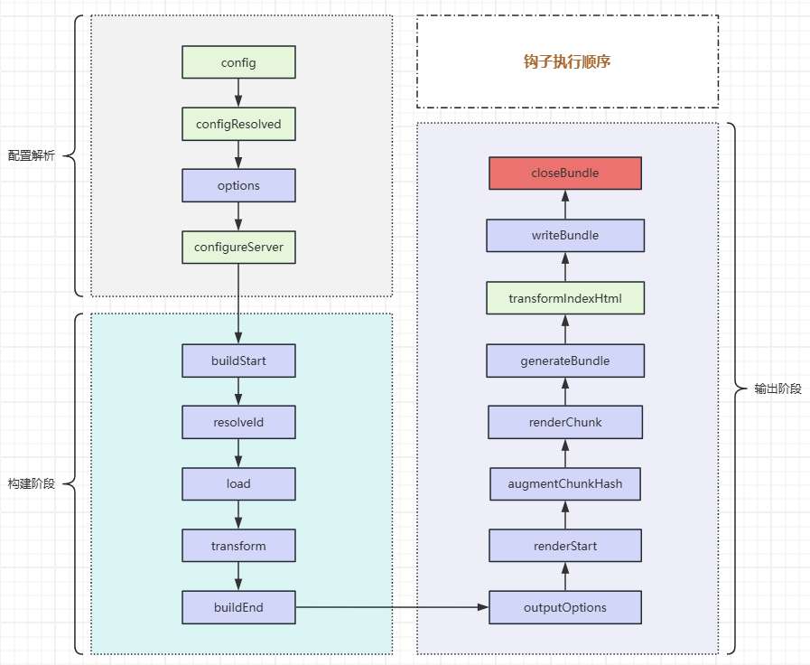

# Vite

https://cn.vitejs.dev/guide/


## 环境变量

默认以 `VITE` 开头的环境变量会通过 `import.meta.env` 暴露在客户端源码

### 内置变量

```shell
import.meta.env.MODE	# development、production
import.meta.env.BASE_URL	# 部署时基本URL，由Base配置项决定，默认 /
import.meta.env.PROD	# 是否为生产环境
import.meta.env.DEV 	# 是否为开发环境
import.meta.env.SSR		# 是否为服务端渲染
```

环境文件: 使用 [dotenv](https://github.com/motdotla/dotenv) 从环境目录中的下列文件加载额外的环境变量并暴露在 `import.meta.env `

```shell
.env                # 所有情况下都会加载
.env.local          # 所有情况下都会加载，但会被 git 忽略
.env.[mode]         # 只在指定模式下加载
.env.[mode].local   # 只在指定模式下加载，但会被 git 忽略

.env.development		# 默认开发环境文件，优先级大于.env
.env.production			# 默认生产环境文件，优先级大于.env
```

```shell
vite --mode <mode>	# 可通过 --mode 指定使用的环境文件
```

### 环境模式

`NODE_ENV(process.env.NODE_ENV) `与 `Vite Mode`是不同概念

| Command                                              | NODE_ENV        | Mode            |
| :--------------------------------------------------- | :-------------- | :-------------- |
| `vite build`                                         | `"production"`  | `"production"`  |
| `vite build --mode development`                      | `"production"`  | `"development"` |
| `NODE_ENV=development vite build`                    | `"development"` | `"production"`  |
| `NODE_ENV=development vite build --mode development` | `"development"` | `"development"` |

| Command                | `import.meta.env.PROD` | `import.meta.env.DEV` |
| :--------------------- | :--------------------- | :-------------------- |
| `NODE_ENV=production`  | `true`                 | `false`               |
| `NODE_ENV=development` | `false`                | `true`                |
| `NODE_ENV=other`       | `false`                | `true`                |

| Command              | `import.meta.env.MODE` |
| :------------------- | :--------------------- |
| `--mode production`  | `"production"`         |
| `--mode development` | `"development"`        |
| `--mode staging`     | `"staging"`            |


## 插件开发

::: tip

Rollup的配置受插件顺序的影响，后面的插件会覆盖前面插件的选项<br/>
Vite配置中的`rollupOptions`是作为默认值，插件中的相关配置会覆盖该默认值

:::

### 插件执行顺序

https://github.com/vitejs/vite/blob/main/packages/vite/src/node/plugins/index.ts

1、别名处理Alias

2、用户插件设置`enforce: 'pre'`

3、vite 核心插件

4、用户插件未设置`enforce`

5、vite 构建插件

6、用户插件设置`enforce: 'post'`

7、vite 构建后置插件


### 钩子执行顺序

 

 

### Vite 独有钩子

[config(config, env)](https://cn.vitejs.dev/guide/api-plugin.html#config) ：解析Vite配置前调用，兜底配置项

[configResolved(config)](https://cn.vitejs.dev/guide/api-plugin.html#configresolved) ：解析 Vite 配置后调用，读取和存储最终解析的配置

[configureServer(server)](https://cn.vitejs.dev/guide/api-plugin.html#configureserver) ：配置开发服务器

[handleHotUpdate(ctx)](https://cn.vitejs.dev/guide/api-plugin.html#handlehotupdate)`：执行自定义HMR更新，可以通过ws往客户端发送自定义的事件

[transformIndexHtml(html)](https://cn.vitejs.dev/guide/api-plugin.html#transformindexhtml) ：转换 index.html 的专用钩子

```ts
transformIndexHtml(html) {
  if (!build) return html
  // 打包新版本后，需要使用最新文件信息，防止使用缓存
  const version = new Date().getTime()
  const regex = /<script\s+src="\/setting\.js"([^>]*)>/g

  // 参数1：匹配到的字符串
  // 参数2：匹配到的字符串中第一个括号的内容
  return html.replace(
    regex, 
    (_, attrs) => `<script ${attrs} src="./settings.js?v=${version}">`
  )
}
```

::: info 插件属性

`enforce` ：`pre | post `

`apply` ：`server | build | function`，默认开发和生产均执行

:::


### 通用钩子构建阶段

[options(options)](https://rollupjs.org/plugin-development/#options)：服务启动时调用（构建阶段前），提供Rollup配置


[buildStart(options)](https://rollupjs.org/plugin-development/#buildstart)：开始构建前调用，可以获取Rollup配置

```ts
buildStart() {
  // 清理缓存
  const cacheFile = './cache.json'
  if (fs.existsSync(cacheFile)) fs.unlinkSync(cacheFile)
}
```


[resolveId(id, importer, options)](https://rollupjs.org/plugin-development/#resolveid)：路径解析，解析文件、虚拟模块路径

::: tip

多个插件都定义该钩子时，按顺序执行，直到其中一个钩子返回非空的值，之后的将不再执行

:::


::: tip 虚拟模块

虚拟模块是一种在构建过程中动态生成的模块，它们不是实际存在于文件系统中的文件，而是在构建过程中由构建工具动态生成的。虚拟模块在运行时表现得像普通的JavaScript模块，但它们在文件系统中并不存在对应的物理文件‌

Rollup中约定虚拟模块要在模块ID前添加前缀`\0`，虚拟模块ID：`\0${id}`

:::


[load(id)](https://rollupjs.org/plugin-development/#load)：读取文件，读取磁盘、网络文件

```ts
import '@cdn/jquery'
import jQuery from 'jquery'

console.log(jQuery)
```

```ts
  resolveId(id) {
    if (id === 'jquery') {
      return `\0${id}`
    }

    if (id == '@cdn/jquery') {
      return id
    }
  },
  load(id) {
    if (id === '\0jquery') {
      return `export default window.jQuery`
    }

    if (id == '@cdn/jquery') {
      return `import "https://unpkg.com/jquery@3.7.1/dist/jquery.js"`
    }
  }
```


[transform(code, id)](https://rollupjs.org/plugin-development/#transform)：文件内容转换，可视化平台：[AST Explorer](https://astexplorer.net/)

```ts
transform(code, id) {
  if(!id.endsWith('main.ts')) return code 
  const ast = this.parse(code)
  console.log(ast)
  return code
}
```


[buildEnd](https://rollupjs.org/plugin-development/#buildend)：构建结束后调用（`before generate or  write`），代表依赖图相关模块已转换完成

```ts
// 可用于执行一些清理操作
buildEnd(error?: Error) {
  const moduleIds = this.getModuleIds()
  console.log('All module IDs:', moduleIds)
}
```


### 通用钩子构建输出阶段

[outputOptions(options)](https://rollupjs.org/plugin-development/#outputoptions)：定义文件输出格式、如输出文件路径、文件名格式..

```ts
outputOptions(options) {
  return {
    ...options,
    entryFileNames: `js/[name]-[hash].js`,
    chunkFileNames: `js/[name]-[hash].js`,
    assetFileNames(assetsInfo) {
      let name = assetsInfo.name || assetsInfo.names[0]
      const imgExits = ['png', 'jpg', 'jpeg', 'gif', 'svg', 'webp']
      if (!name) return ''
      if (imgExits.includes(name)) {
        return `images/[name]-[hash].[ext]`
      }

      if (name.endsWith('.css')) {
        return `css/${name}-[hash].[ext]`
      }

      return `assets/[name]-[hash].[ext]`
    },
    manualChunks: {
      vue: ['vue', 'vue-router'],
      elementPlus: ['element-plus'],
    },
  }
}
```

[renderStart(outputOptions, inputOptions)](https://rollupjs.org/plugin-development/#renderstart)： 开始渲染输出文件前调用

```
可执行一些初始化操作
bundle.generate() or bundle.write() 均会调用
```

[augmentChunkHash(chunkInfo)](https://rollupjs.org/plugin-development/#augmentchunkhash)：给代码块添加哈希值

[renderChunk(code, chunk, options, meta)](https://rollupjs.org/plugin-development/#renderchunk)：生成最终代码块之前可对代码自定义处理

```
优化代码，如压缩、风格修改
在生成的代码块中添加自定义内容，如添加注释
```

[generateBundle(options, bundle, isWrite)](https://rollupjs.org/plugin-development/#generatebundle)：生成输出文件后写入文件前调用

```
bundle.generate 之后；bundle.wrate 之前
```

[writeBundle(options, bundle)](https://rollupjs.org/plugin-development/#writebundle)：输出文件写入系统后调用

```
bundle.write 之后
```

[closeBundle()](https://rollupjs.org/plugin-development/#closebundle)：完成打包时调用，可用于清理工作

```
完成打包后需要手动调用 bundle.close 此时会触发该钩子 
```


::: tip bundle

正在写入或生成的文件的完整列表及其详细信息

:::