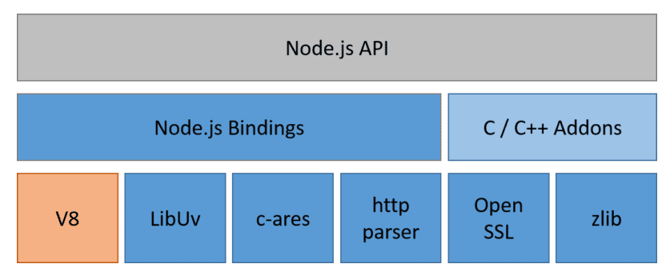

# 架构设计

Nodejs 是开源、跨平台的 JavaScript 运行时环境

Nodejs 为 JavaScript 提供了一个平台，使其能够调用 C/C++接口，扩展它的能力

Nodejs 适合I/O密集型型应用，不适合CPU密集型型应用，它是单线程的容易造成CPU占用率高

 

`Nodejs Bindings`：JavaScript与C/C++桥梁，将C/C++封装为JavaScript可调用的API

`C/C++ Addons`: 支持以C/C++编写插件，扩展Nodejs能力

`V8`：Google开发的JavaScript引擎，提供JavaScript运行环境

`Libuv`：提供异步I/O和事件驱动，高效处理大量并发请求

`c-ares、http_parser、OpenSSL...`：提供DNS解析、http解析、SSL、数据压缩等其它能力

::: info I/O密集型

数据库管理系统：查询、数据插入、数据更新...

Web服务器：处理HTTP请求、响应客户端、数据传输...

文件系统：文件读写、文件同步、文件备份...

实时通信：在线聊天、在线游戏...

:::

::: info CPU密集型

数据分析：大数据处理、机器学习、统计分析...

图像视频：图形识别、图形渲染、视频编码解码...

加密解密：数据加密、密码破解...

:::